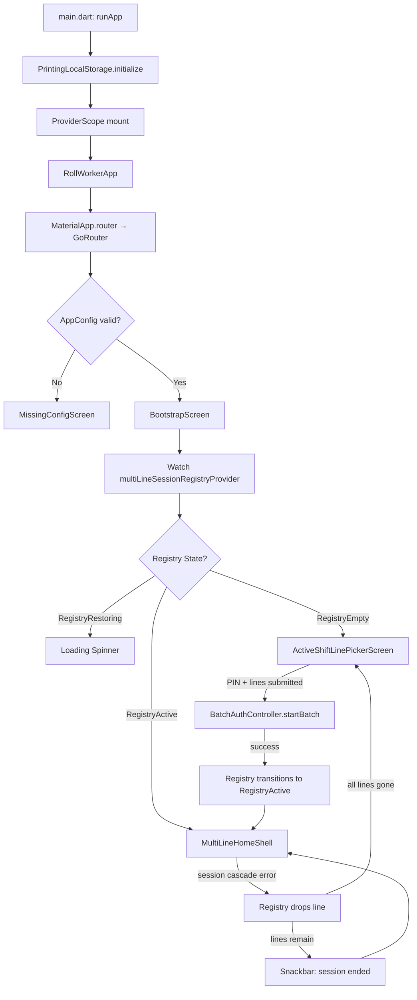
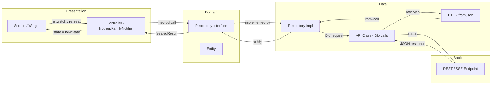

# Roll Worker System Architecture Documentation

**Document ID:** 01_ROLL_WORKER_SYSTEM_ARCHITECTURE  
**Version:** 1.0.0  
**Date:** 2026-05-14  
**Project:** Thermoforming Roll Worker Flutter App (`thermoforming_roll_worker`)  
**Author:** Architecture AI — sourced from static codebase analysis  
**Status:** Production-Grade Reference

---

## 1. Purpose of This Documentation

This document is the authoritative architecture reference for the **Thermoforming Roll Worker Flutter Application**. It is designed to be read by:

- **Backend engineers** integrating or extending the API surface this app consumes.
- **Flutter engineers** joining the project who need a fast, accurate mental model of how the app is structured before touching code.
- **AI coding agents** (Claude Code, Copilot, Cursor, etc.) that are instructed to read this document before making any code changes, refactors, or additions to the codebase.
- **QA engineers** writing test plans who need to understand data flows, error paths, and business invariants.
- **Security reviewers** assessing the app's threat surface.

The document covers every architectural layer: startup, state management, API integration, security, domain model, error handling, multi-line session orchestration, and offline behavior. It does not substitute for reading the code, but it provides the conceptual scaffolding that makes the code intelligible without hours of manual tracing.

Every fact in this document was derived from the actual source files in `lib/`. If you find a discrepancy between this document and the live source code, the source code wins. Update this document to match reality — never change code to match a stale document.

---

## 2. Documentation Scope

This document covers the following dimensions of the application:

| Dimension | Coverage |
|---|---|
| App identity and entry point | Full |
| Bootstrap and startup state machine | Full |
| Project directory structure | Full (annotated) |
| Clean Architecture layer conventions | Full |
| Riverpod state management topology | Full |
| API client, interceptors, envelope format | Full |
| All 11 backend endpoints consumed | Full |
| Security model (tokens, PIN, device key) | Full |
| Business domain glossary | Full (18 terms) |
| Multi-line session orchestration | Full |
| SSE (Server-Sent Events) integration | Full |
| Error propagation model (sealed results) | Full |
| UI/UX architecture principles | Full |
| Performance and reliability considerations | Full |
| Offline and connectivity behavior | Full |
| Known risks and technical debt | Full (table with remediation guidance) |
| AI agent coding rules | Full |

What this document does NOT cover:

- Detailed widget tree breakdown of individual screens (that is covered in the UX handoff documents).
- Backend implementation details (that is covered in the backend handoff documents).
- Printer hardware protocol internals (TSPL command set, TCP transport mechanics).
- Build pipeline, CI/CD, or release management.
- Automated test strategy (covered separately).

---

## 3. Source of Truth Rules

The following hierarchy governs which artifact wins when there is a conflict:

1. **Running backend API responses** — the backend is authoritative for all data shapes and error codes.
2. **Dart source files in `lib/`** — the only authoritative record of app behavior.
3. **This document** — a derived artifact; must be updated to stay accurate but never supersedes code.
4. **Other markdown docs in `docs/`** — supplemental context; may be outdated.
5. **Comments in code** — useful but can drift; treat as hints, not contracts.

**For AI agents specifically:** Read this document first for orientation. Then read the specific source files relevant to your task. Do not rely solely on this document for implementation details — always verify the current file content before editing.

---

## 4. App Identity

| Property | Value |
|---|---|
| App title (Arabic) | `'تطبيق عامل الرولات'` (Roll Worker Application) |
| Root widget class | `RollWorkerApp` |
| Root widget base | `ConsumerStatefulWidget` (Riverpod) |
| Entry point | `lib/main.dart` |
| Material design version | Material 3 (via `useMaterial3: true` in theme) |
| Locale | Arabic (`ar`) — RTL enforced globally |
| Text direction | `TextDirection.rtl` — wrapped at root via `Directionality` widget |
| State management framework | Riverpod 2.6.1 |
| Routing framework | GoRouter 14.6.2 |
| Local persistence | Hive (printer configs) + flutter_secure_storage (session tokens) |
| Primary color | `#2D8A5E` (green) |
| Accent color | `#FF9C00` (orange) |
| Error color | `#D32F2F` (red) |
| Platform target | Android (primary), iOS (secondary) |

The app title in Arabic (`تطبيق عامل الرولات`) is what appears in the OS task switcher and in `MaterialApp`'s `title` property. All in-app labels, dialogs, and error messages are also in Arabic; there is no i18n abstraction layer — strings are hardcoded in Arabic throughout.

The `RollWorkerApp` widget constructs a `MaterialApp.router` instance wired to the GoRouter instance exported from `lib/app/router.dart`. It wraps the entire widget tree in a `Directionality` widget with `textDirection: TextDirection.rtl` to enforce right-to-left layout regardless of device locale settings.

---

## 5. Runtime Composition

### 5.1 Entry Point and Initialization Sequence

The entry point is `lib/main.dart`. The initialization sequence is deliberately minimal and synchronous-first:

1. `WidgetsFlutterBinding.ensureInitialized()` — standard Flutter binding setup.
2. `PrintingLocalStorage.initialize()` — opens Hive boxes for printer configuration and label presets. This is `await`-ed before `runApp` to ensure Hive is ready before any widget accesses it.
3. `runApp(ProviderScope(child: RollWorkerApp()))` — mounts the Riverpod container and the root widget tree.

The `ProviderScope` at the root ensures that all Riverpod providers are scoped to the full application lifetime. There is no scoped override at any sub-tree level in this app.

### 5.2 App Router Composition

The GoRouter instance in `lib/app/router.dart` defines exactly two named routes:

| Route Name Constant | Path | Screen |
|---|---|---|
| `AppRoutes.bootstrap` | `/` | `BootstrapScreen` |
| `AppRoutes.missingConfig` | `/missing-config` | `MissingConfigScreen` |

A redirect gate at the router level checks `AppConfig` validity on every navigation. If the build-time configuration (base URL, device key) is missing or malformed, the router unconditionally redirects to `/missing-config` regardless of what route was requested. This prevents any feature screen from rendering with a broken API configuration.

There is no deep-link support. All navigation paths that lead to feature screens (home, scan, label reprint, printer settings, etc.) are handled inside the `BootstrapScreen`'s widget tree using Navigator/showDialog/push — not via GoRouter named routes. GoRouter is used only as the application shell entry gate.

### 5.3 Bootstrap Screen State Machine

`lib/app/bootstrap_screen.dart` is the true root of the application's interactive surface. It is a `ConsumerStatefulWidget` that implements `WidgetsBindingObserver` to receive app lifecycle events.

The screen watches the `multiLineSessionRegistryProvider` and renders one of three states:

| Registry State | UI Rendered |
|---|---|
| `RegistryRestoring` | Full-screen loading spinner (circular progress indicator, centered) |
| `RegistryEmpty` | `ActiveShiftLinePickerScreen` — the login/line-selection UI |
| `RegistryActive` | `MultiLineHomeShell` — the main working UI with one session or more |



### 5.4 App Lifecycle Handling

`BootstrapScreen` registers itself as a `WidgetsBindingObserver`. On `didChangeAppLifecycleState(AppLifecycleState.resumed)`:

1. Re-fetches picker options (refreshes the list of available active shift lines from the backend).
2. Restores sessions — re-validates all stored session tokens against the backend's current session endpoint. Sessions that are no longer valid on the backend are dropped from the registry, triggering cascade cleanup.

This means the app handles backgrounding gracefully: if the worker's shift line was ended by an operator while the app was backgrounded, the app detects this on foreground resume and cleans up without requiring a manual refresh.

### 5.5 Cascade Error and Snackbar

When any per-line controller encounters a `ROLL_WORKER_SESSION_REQUIRED` error (or equivalent session-invalidating error code), it calls `notifySessionLost(shiftLineId)` on the `MultiLineSessionRegistryNotifier`. The registry:

1. Removes the affected `shiftLineId` from its active set.
2. Deletes the session token from `SecureTokenStorage` for that line.
3. Emits a `LineLost` registry event.

`BootstrapScreen` reacts to the `LineLost` event by showing a snackbar with the message:

> `"تم إنهاء الخط أو جلسة عامل الرولات، تم تحديث الحالة"`

After consuming the event, `clearLastEvent()` is called on the registry to prevent the snackbar from re-appearing on the next rebuild.

If all active lines are lost, the registry transitions to `RegistryEmpty`, which causes `BootstrapScreen` to render `ActiveShiftLinePickerScreen`, effectively logging the worker out.

---

## 6. Project Structure

The full annotated directory layout of `lib/`:

```
lib/
│
├── main.dart                         # Entry point: Hive init → runApp(ProviderScope)
│
├── app/
│   ├── app.dart                      # RollWorkerApp widget, MaterialApp.router, theme injection,
│   │                                 # Arabic locale, RTL Directionality wrapper
│   ├── router.dart                   # GoRouter: 2 routes only (/ and /missing-config)
│   │                                 # AppConfig redirect gate
│   └── bootstrap_screen.dart         # Root state machine: RegistryRestoring/Empty/Active
│                                     # WidgetsBindingObserver for app resume handling
│
├── core/
│   ├── api/
│   │   ├── api_client.dart           # Singleton Dio instance, timeout config (8s/12s),
│   │   │                             # interceptor chain registration
│   │   ├── api_paths.dart            # All URL path constants (no hardcoded paths elsewhere)
│   │   ├── api_error_parser.dart     # DioException → AppFailure sealed type mapping
│   │   ├── response_envelope.dart    # Extracts `data` field from {"data": {...}} responses
│   │   ├── session_token_interceptor.dart  # Attaches X-Session-Token header when token provided
│   │   ├── device_key_interceptor.dart     # Attaches X-Device-Key header to every request
│   │   └── redacting_logger_interceptor.dart  # Debug-only request/response logging;
│   │                                           # redacts X-Session-Token and `pin` fields
│   │
│   ├── config/
│   │   └── app_config.dart           # BuildConfig reader: baseUrl, deviceKey
│   │                                 # (populated at build time via --dart-define)
│   │
│   ├── errors/
│   │   ├── app_failure.dart          # Sealed class: BusinessFailure(code) | ServerFailure |
│   │   │                             # TransportFailure
│   │   ├── error_code.dart           # Enum of all known backend business error codes
│   │   └── error_messages_ar.dart    # arabicMessageFor(AppFailure) → Arabic string
│   │
│   ├── storage/
│   │   ├── secure_token_storage.dart     # flutter_secure_storage wrapper; read/write/clear
│   │   │                                 # session tokens keyed by shiftLineId
│   │   └── session_index_storage.dart    # Persists Set<int> of active shiftLineIds
│   │                                     # for cold-start session recovery
│   │
│   ├── theme/
│   │   ├── app_theme.dart            # AppTheme.light() — ThemeData factory
│   │   └── app_colors.dart           # Color constants: primary, accent, error, surface, etc.
│   │
│   └── ui/
│       ├── app_scaffold.dart         # Scaffold wrapper with common AppBar patterns
│       ├── app_primary_button.dart   # Elevated button, full-width, loading state
│       ├── app_secondary_button.dart # Outlined button variant
│       ├── app_card.dart             # Surface-colored Card with consistent padding/radius
│       ├── info_row.dart             # Label + value horizontal row (used in summary cards)
│       ├── inline_error.dart         # Inline error message widget (red text + icon)
│       ├── empty_state_view.dart     # Centered icon + message for empty list states
│       ├── loading_button.dart       # Button that swaps to spinner when loading=true
│       └── connectivity_banner.dart  # Top banner shown when device has no network
│
└── features/
    │
    ├── home/                         # Core home screen, shift summary, multi-line shell
    │   ├── data/
    │   │   ├── dtos/                 # ShiftLineSummaryDto, MountedRollDto, etc.
    │   │   ├── api/                  # ShiftLineSummaryApi (Dio calls)
    │   │   └── repositories/        # ShiftLineSummaryRepositoryImpl
    │   ├── domain/
    │   │   ├── entities/             # ShiftLineSummary, MountedRoll, ActiveProduct,
    │   │   │                         # ReturnedRemainingRoll, etc.
    │   │   └── repositories/        # ShiftLineSummaryRepository (interface)
    │   └── presentation/
    │       ├── controllers/          # ShiftLineSummaryController (FamilyNotifier)
    │       │                         # ShiftLineSummaryState (sealed)
    │       ├── screens/              # RollWorkerHomeScreen, MultiLineHomeShell
    │       └── widgets/              # SummaryCard, ActiveProductChip, CompactLineHeader,
    │                                 # CompactMountedRollCard, ReturnedRemainingCard,
    │                                 # LogoutAllConfirmDialog
    │
    ├── shift_line/                   # Line selection/picker before login
    │   ├── data/ domain/ presentation/
    │   └── presentation/
    │       ├── controllers/          # ActiveShiftLineOptionsController (Notifier)
    │       │                         # SelectedShiftLineProvider
    │       └── screens/              # ActiveShiftLinePickerScreen
    │
    ├── operator_dashboard_sse/       # SSE event stream from operator dashboard
    │   ├── data/
    │   │   ├── sse_client.dart       # Dio streaming, SSE frame parsing
    │   │   └── sse_frame_parser.dart # Parses `data:` lines from SSE byte stream
    │   ├── domain/
    │   │   └── entities/             # OperatorDashboardEvent (sealed: ProductChanged, etc.)
    │   └── presentation/
    │       └── controllers/          # OperatorDashboardSyncController (FamilyNotifier)
    │
    ├── roll_scan/                    # QR scan + manual entry for roll mounting
    │   ├── data/ domain/ presentation/
    │   └── presentation/
    │       ├── controllers/          # RollScanController (FamilyNotifier)
    │       ├── screens/              # ScanRollScreen
    │       └── widgets/              # ManualRollInputDialog
    │
    ├── previous_roll/                # Resolve unmounted previous roll
    │   ├── data/ domain/ presentation/
    │   └── presentation/
    │       ├── controllers/          # PreviousRollResolutionController (FamilyNotifier)
    │       └── widgets/              # ClosePreviousRollDialog, FullConsumeConfirmDialog,
    │                                 # ReturnRemainingDialog, GrindingDialog
    │
    ├── label_reprint/                # Reprint roll label to Bluetooth/TCP printer
    │   ├── data/ domain/ presentation/
    │   └── presentation/
    │       ├── controllers/          # LabelReprintController (FamilyNotifier)
    │       ├── screens/              # LabelPreviewScreen
    │       └── widgets/              # PrintInProgressDialog, LabelStickerWidget
    │
    ├── printer/                      # Printer settings + TSPL label printing
    │   ├── data/
    │   │   ├── hive/                 # PrinterConfig (typeId 10), PrinterPreset (typeId 11)
    │   │   ├── tspl/                 # TSPLBuilder — constructs TSPL command strings
    │   │   └── transport/            # PrinterClient (TCP socket), PrinterTransport (abstraction)
    │   ├── domain/
    │   └── presentation/
    │       ├── controllers/          # PrinterSettingsController (Notifier)
    │       └── screens/              # PrinterSettingsScreen
    │
    ├── roll_worker_auth/             # PIN entry + batch session start + registry
    │   ├── data/ domain/ presentation/
    │   └── presentation/
    │       ├── controllers/          # BatchAuthController (Notifier)
    │       │                         # MultiLineSessionRegistryNotifier (Notifier)
    │       └── screens/              # PinScreen
    │
    └── config_check/                 # Missing build config screen
        └── presentation/
            └── screens/              # MissingConfigScreen
```

---

## 7. Architecture Pattern

### 7.1 Clean Architecture Overview

Every feature in this app follows a strict three-layer Clean Architecture pattern:

**Presentation Layer** (Flutter widgets + Riverpod controllers)
- Screens watch controllers via `ref.watch(someControllerProvider(shiftLineId))`.
- Controllers are Riverpod `Notifier` or `FamilyNotifier` subclasses.
- Screens never call repositories or APIs directly.
- Controllers translate UI intents (button taps) into repository calls and translate results into state transitions.

**Domain Layer** (Pure Dart entities + repository interfaces)
- Entities are immutable value objects with no Flutter or Dio dependencies.
- Repository interfaces are abstract classes defining the contract.
- No `async` framework coupling — repositories return `Future<SomeResult>` using project-local sealed result types.

**Data Layer** (DTOs + API classes + repository implementations)
- DTOs are `fromJson` factory methods on plain Dart classes.
- API classes are thin wrappers around Dio call invocations.
- Repository implementations map DTOs → entities, catch `AppFailure` from `ApiErrorParser`, and return sealed results.

### 7.2 Sealed Result Types

Every repository method returns a sealed result. No exceptions cross the repository boundary. The general pattern:

```dart
// Conceptual — each feature defines its own result sealed type
sealed class ScanRollResult {}
class ScanRollSuccess extends ScanRollResult { final MountedRoll roll; ... }
class ScanRollFailure extends ScanRollResult { final AppFailure failure; ... }
```

Controllers switch on the result type:

```dart
final result = await _repository.scanRoll(shiftLineId, rollId);
switch (result) {
  case ScanRollSuccess(:final roll):
    state = RollScanState.success(roll);
  case ScanRollFailure(:final failure):
    state = RollScanState.error(arabicMessageFor(failure));
}
```

This ensures the UI never sees raw exceptions or Dio internals.

### 7.3 Data Flow Diagram



### 7.4 Family vs. Global Providers

There are two categories of Riverpod providers in this app:

**FamilyNotifier (keyed by `shiftLineId: int`):**
Used for all per-line state. A single worker logged into three lines simultaneously has three independent instances of each FamilyNotifier. Providers in this category:

- `ShiftLineSummaryController`
- `RollScanController`
- `PreviousRollResolutionController`
- `LabelReprintController`
- `OperatorDashboardSyncController`

**Notifier (global, single instance):**
Used for app-wide concerns. Providers in this category:

- `MultiLineSessionRegistryNotifier` — the source of truth for which lines are active.
- `BatchAuthController` — handles PIN entry and the start-batch API call.
- `ActiveShiftLineOptionsController` — fetches and caches available shift lines from backend.
- `PrinterSettingsController` — manages Hive-backed printer configuration.

### 7.5 SSE Integration in Architecture

The `OperatorDashboardSyncController` (FamilyNotifier, keyed by shiftLineId) manages an active SSE subscription. When the controller is initialized for a given `shiftLineId`:

1. It starts a Dio streaming request to the SSE endpoint.
2. The `SseFrameParser` processes the raw byte stream into discrete `data:` events.
3. Each parsed event is deserialized into an `OperatorDashboardEvent` sealed type.
4. The controller dispatches each event to the appropriate FamilyNotifier method:
   - `ShiftLineSummaryController.applyProductChanged(...)` for product-change events.
   - `ShiftLineSummaryController.applyRollMounted(...)` for roll-mounted events.
   - (etc., as implemented)
5. The `ShiftLineSummaryController` performs an in-place merge update of its state — it updates only the changed fields without making a new REST call to the summary endpoint.

This architecture means that the home screen stays live without polling. The REST summary endpoint is used only for the initial load and after non-SSE-covered state changes (e.g., after a successful scan-roll action).

---

## 8. State Management Architecture

### 8.1 Riverpod Provider Topology

The provider graph flows from global (bottom) to per-line (top):

```
multiLineSessionRegistryProvider          ← global, Notifier
    └─ batchAuthControllerProvider        ← global, Notifier
    └─ activeShiftLineOptionsProvider     ← global, Notifier

shiftLineSummaryControllerProvider(id)   ← per-line, FamilyNotifier
    └─ operatorDashboardSyncProvider(id) ← per-line, FamilyNotifier (dispatches to summary)

rollScanControllerProvider(id)           ← per-line, FamilyNotifier
previousRollResolutionControllerProvider(id) ← per-line, FamilyNotifier
labelReprintControllerProvider(id)       ← per-line, FamilyNotifier

printerSettingsControllerProvider        ← global, Notifier
selectedShiftLineProvider                ← global, StateProvider (ephemeral UI state)
```

### 8.2 Registry State Machine

The `MultiLineSessionRegistryNotifier` is the most critical provider in the app. Its state transitions govern the entire UI:

```
Initial:  RegistryRestoring
    │
    ├─ Cold start: reads SessionIndexStorage
    │     ├─ If stored IDs exist → validates each via GET /current → RegistryActive or RegistryEmpty
    │     └─ If no stored IDs → RegistryEmpty
    │
    ├─ BatchAuthController.startBatch() succeeds
    │     └─ → RegistryActive (with new session set)
    │
    ├─ notifySessionLost(shiftLineId) called by any controller
    │     ├─ Removes shiftLineId from active set
    │     ├─ Clears token from SecureTokenStorage
    │     ├─ Emits LineLost event
    │     ├─ If remaining lines > 0 → stays RegistryActive
    │     └─ If no lines remain → RegistryEmpty
    │
    └─ logoutAll() called
          └─ Calls logout API for each line → clears all tokens → RegistryEmpty
```

### 8.3 Multi-Line Session Data Structure

The registry holds a `List<ActiveSessionEntry>` where each entry contains:

- `shiftLineId: int` — the primary key.
- `shiftLineCode: String` — display label (e.g., "TH-01").
- `sessionToken: String` — the raw session token (used only to pass to `SecureTokenStorage` and to `SessionTokenInterceptor`; NOT stored in-memory beyond what's needed for the current operation).
- Other metadata needed to identify the line in the multi-line shell's NavigationBar.

The `SessionIndexStorage` persists only the `Set<int>` of `shiftLineId` values. The actual tokens are always retrieved from `SecureTokenStorage` on demand, never from in-memory state beyond the immediate operation.

### 8.4 ShiftLineSummaryController State Transitions

`ShiftLineSummaryController` (FamilyNotifier keyed by `shiftLineId`) manages the state of a single home screen. Its state is a sealed type with these variants:

| State Variant | Meaning | UI Behavior |
|---|---|---|
| `Loading` | Initial fetch in progress | Skeleton/spinner shown |
| `Loaded(summary)` | Summary data available | Home screen renders full content |
| `Error(message)` | Fetch failed | Inline error with retry button |
| `Refreshing(summary)` | Background refresh after an action | Shows existing content, subtle indicator |
| `ActionInProgress` | A sub-action (scan, close, reprint) is pending | Buttons disabled |

SSE events call `.apply*()` methods that transition from `Loaded` → `Loaded` with a partial merge, never causing a full reload spinner for live data updates.

### 8.5 State Immutability

All state objects in this app are immutable value objects (typically implemented with `copyWith` methods or as simple constructors). Controllers never mutate state objects in place — they always produce a new state value and assign it to `state =`. This ensures Riverpod's equality-based rebuild optimization works correctly.

---

## 9. API and Backend Integration Architecture

### 9.1 HTTP Client Configuration

The Dio singleton is configured in `lib/core/api/api_client.dart`:

```
Base URL:         AppConfig.baseUrl  (set at build time via --dart-define)
Connect timeout:  8,000 ms
Send timeout:     12,000 ms
Receive timeout:  12,000 ms
```

No custom retry logic is implemented at the Dio layer. Retry behavior (if any) is handled at the controller level on a per-action basis.

### 9.2 Interceptor Chain

Three interceptors are registered on the Dio instance, applied in this order:

**1. DeviceKeyInterceptor**
- Adds the `X-Device-Key` header to every outgoing request.
- Device key value comes from `AppConfig.deviceKey` (build-time config).
- No conditional logic — the header is always added.

**2. SessionTokenInterceptor**
- Does NOT add `X-Session-Token` to every request.
- Session token must be explicitly attached to specific requests via a `.attach(token)` mechanism.
- This design means unauthenticated endpoints (e.g., `GET /active-options`, `POST /start-batch`) naturally do not carry a session token even if one is in storage.
- Per-line controllers retrieve the token from `SecureTokenStorage` before making any authenticated call, then attach it to the Dio options for that specific request.

**3. RedactingLoggerInterceptor**
- Active in debug mode only.
- Logs request method, URL, headers (with `X-Session-Token` value replaced by `[REDACTED]`), and response body.
- Redacts the `pin` field in request bodies.
- Ensures no secrets appear in developer console output.

### 9.3 Response Envelope

All successful API responses from this backend follow the envelope format:

```json
{
  "data": { ... }
}
```

`ResponseEnvelope.extract(response)` unwraps this envelope and throws a parseable error if the `data` key is absent. Repository implementations always call `extract` before constructing DTOs.

### 9.4 Error Envelope and Parsing

Business errors from the backend follow:

```json
{
  "errorCode": "ROLL_WORKER_SESSION_REQUIRED",
  "message": "Human-readable message in English"
}
```

`ApiErrorParser` converts `DioException` instances into `AppFailure` sealed types:

| DioException Type | AppFailure Result |
|---|---|
| HTTP 4xx with `errorCode` body | `BusinessFailure(code: ErrorCode.xxx)` |
| HTTP 5xx | `ServerFailure()` |
| Connection error, timeout | `TransportFailure()` |
| HTTP 4xx without parseable body | `ServerFailure()` |

`ErrorCode` is an enum of all known business error codes. Unknown codes received from the backend are mapped to a fallback `BusinessFailure` with a generic message.

`arabicMessageFor(AppFailure)` in `error_messages_ar.dart` maps each failure variant to a user-facing Arabic string. This is the single translation point for error messages — no Arabic error strings exist anywhere else in the app.

### 9.5 Endpoint Reference

All path constants are in `lib/core/api/api_paths.dart`. No URL strings are hardcoded in feature code.

| # | Method | Path | Auth Headers | Purpose |
|---|---|---|---|---|
| 1 | GET | `/api/v1/thermoforming-roll-app/shift-lines/active-options` | `X-Device-Key` only | Fetch list of active shift lines for picker |
| 2 | GET | `/api/v1/thermoforming-roll-app/shift-lines/{id}/roll-worker-session/current` | `X-Device-Key` only | Validate/restore existing session on cold start |
| 3 | POST | `/api/v1/thermoforming-roll-app/sessions/start-batch` | `X-Device-Key` only | Start sessions for multiple lines with PIN |
| 4 | POST | `/api/v1/thermoforming-roll-app/shift-lines/{id}/roll-worker-logout` | `X-Device-Key` only | Logout worker from a specific line |
| 5 | GET | `/api/v1/thermoforming-roll-app/shift-lines/{id}/summary` | `X-Device-Key` + `X-Session-Token` | Fetch home screen summary data |
| 6 | POST | `/api/v1/thermoforming-roll-app/shift-lines/{id}/scan-roll` | `X-Device-Key` + `X-Session-Token` | Mount a new roll on the line |
| 7 | POST | `/api/v1/thermoforming-roll-app/shift-lines/{id}/previous-roll/full-consume` | `X-Device-Key` + `X-Session-Token` | Close previous roll as fully consumed |
| 8 | POST | `/api/v1/thermoforming-roll-app/shift-lines/{id}/previous-roll/return` | `X-Device-Key` + `X-Session-Token` | Close previous roll with partial return to warehouse |
| 9 | POST | `/api/v1/thermoforming-roll-app/shift-lines/{id}/previous-roll/grinding` | `X-Device-Key` + `X-Session-Token` | Close previous roll with partial remainder sent to grinding |
| 10 | GET | `/api/v1/thermoforming-roll-app/rolls/{generatedRollId}/reprint-label` | `X-Device-Key` + `X-Session-Token` | Fetch label data for reprinting |
| 11 | GET | `/api/v1/palletizing-line/lines/{lineId}/operator-dashboard/events` | `X-Device-Key` + `X-Session-Token` | SSE stream: operator dashboard live events |

### 9.6 SSE Client Architecture

The SSE connection to endpoint #11 is a long-lived Dio streaming request. Key implementation details:

- The Dio request uses `ResponseType.stream` to receive the body as a byte stream.
- `SseFrameParser` buffers incoming bytes, splits on newline boundaries, and extracts `data:` prefixed lines as discrete event payloads.
- The SSE connection is managed by `OperatorDashboardSyncController`. When the controller is disposed (user logs out of a line, or the app is backgrounded), the stream subscription is cancelled and the Dio request is aborted.
- On SSE disconnection (network drop), the controller does not auto-reconnect indefinitely. The reconnect behavior is triggered by `BootstrapScreen`'s `didChangeAppLifecycleState` on resume, which re-initializes the controller.
- SSE events consumed: product-change events, roll-mounted events, and potentially others as defined by the `OperatorDashboardEvent` sealed type in the domain layer.

### 9.7 Request Parameter Conventions

- `{id}` path parameters are always `int` (shiftLineId).
- `{generatedRollId}` is a 12-character `String` in the format `PPPSSSSSSSSS` (3-char type prefix + 9-char serial).
- `{lineId}` for the SSE endpoint is the palletizing line's integer ID (related to, but distinct from, `shiftLineId`).
- Request bodies are `application/json`; no multipart or form-encoded requests exist in this app.
- The `scan-roll` body is `{"generatedRollId": "..."}`.
- The `previous-roll/return` and `previous-roll/grinding` bodies are `{"remainingWeightKg": 12.5}`.
- The `roll-worker-logout` body is `{"sessionToken": "..."}`.
- The `start-batch` body is `{"pin": "...", "shiftLineIds": [1, 2, 3]}`.

---

## 10. Security Architecture

### 10.1 Session Token Lifecycle

Session tokens are bearer credentials that authenticate a roll worker on a specific shift line. Their lifecycle in the app:

```
Generated by:   Backend (POST /start-batch response)
Stored in:      flutter_secure_storage (Android Keystore-backed / iOS Keychain-backed)
Keyed by:       shiftLineId (integer) — each line has its own storage slot
In-memory:      Only during the duration of a single API call; never held in Riverpod state
Logged:         Never — redacted in all log output
Transmitted:    Only via X-Session-Token header when explicitly attached to a request
Cleared on:     Logout (explicit), session cascade error (automatic), app reinstall (OS clears secure storage)
```

`SecureTokenStorage` provides:
- `readSessionToken(shiftLineId)` — retrieves the stored token.
- `writeSessionToken(shiftLineId, token)` — stores a new token.
- `clearSessionToken(shiftLineId)` — deletes the token for a specific line.
- `clearAll()` — clears all stored tokens (used on full logout).

### 10.2 PIN Security

The worker PIN is a numeric string entered on `PinScreen`. Security properties:

- PIN is NEVER persisted anywhere (not to Hive, not to flutter_secure_storage, not to SharedPreferences).
- PIN is held in a `TextEditingController` in the widget layer only.
- PIN is sent to the backend in the `start-batch` request body as a string.
- The `RedactingLoggerInterceptor` redacts the `pin` field from all logged request bodies.
- `PinScreen` disposes its `TextEditingController` on widget disposal, clearing the in-memory string.
- No PIN hash is stored locally — PIN verification is entirely server-side.

### 10.3 Device Key Security

The device key is a build-time credential embedded via `--dart-define` at compile time. It is read from `AppConfig.deviceKey`. Security properties:

- Not hardcoded in source code as a string literal.
- Added to every request by `DeviceKeyInterceptor`.
- Redacted in log output (or simply not specifically logged since it's in headers).
- Risk: The compiled APK/IPA contains the key in the compiled Dart snapshot. An attacker with access to the binary can extract it via decompilation tools. This is a known risk (see Section 19).
- The device key provides coarse-grained API access control — it is not a substitute for per-user authentication.

### 10.4 Data in Transit

- All API communication is over HTTPS (enforced by `AppConfig.baseUrl` which must be an HTTPS URL in production builds).
- The SSE stream is also over HTTPS.
- TCP printer communication (for label printing) is plaintext on the local network — this is acceptable given the closed factory network context.

### 10.5 Log Redaction

The `RedactingLoggerInterceptor` applies the following redaction rules before writing to the debug console:

| Data | Redaction Rule |
|---|---|
| `X-Session-Token` header value | Replaced with `[REDACTED]` |
| `pin` field in request JSON body | Replaced with `[REDACTED]` |
| `sessionToken` field in response body | Note: `BatchSessionEntryResponse.toString()` also overrides to redact this field |

In release builds, the logger interceptor is either disabled or its output is suppressed via the standard Flutter release mode behavior (`assert` and `kDebugMode` guards).

### 10.6 Authentication Flow Summary

```
Worker opens app
    → BootstrapScreen reads SessionIndexStorage
    → If stored IDs: validates each via GET /current (no session token required)
        → Valid: registry → RegistryActive (token already in SecureStorage)
        → Invalid: registry → RegistryEmpty
    → If no IDs: registry → RegistryEmpty
    → RegistryEmpty: shows ActiveShiftLinePickerScreen
    → Worker selects lines + enters PIN
    → BatchAuthController calls POST /start-batch
    → Backend returns sessionToken per line
    → App stores each token in SecureTokenStorage[shiftLineId]
    → App stores shiftLineIds in SessionIndexStorage
    → Registry → RegistryActive
    → MultiLineHomeShell shown
```

---

## 11. Business Domain Glossary

All domain terms used in the codebase, their Arabic equivalents, and their precise meanings:

| Term (English) | Arabic | Definition |
|---|---|---|
| Roll (رول) | رول | A physical spool/roll of thermoforming film material (plastic). Identified by a 12-digit generated roll ID. Has a type (rollTypeCode), weight, and lifecycle status. |
| Generated Roll ID (معرّف الرول) | معرّف الرول | A 12-character string in the format `PPPSSSSSSSSS`. The first 3 characters are the roll type code prefix. The remaining 9 characters are a unique serial. Encoded in the QR code label on each physical roll. |
| Roll Type (نوع الرول) | نوع الرول | Classification of a roll based on its material or thickness. Has a `rollTypeCode` (short alphanumeric) and a human-readable display name. Determines compatibility with the active product on the line. |
| Thermoforming Line (خط التشكيل) | خط التشكيل | A physical thermoforming production machine (e.g., TH-01, TH-02). The machine that consumes rolls to produce thermoformed trays/containers. |
| Palletizing Line (خط التلبيس) | خط التلبيس | The downstream palletizing machine associated with a thermoforming line. Has its own integer `lineId` used in the SSE endpoint path. |
| Shift Line (خط المناوبة) | خط المناوبة | A thermoforming line active within a specific operational shift. The entity that workers log in to. Carries a `shiftLineId` (int) and `shiftLineCode` (string like "TH-01"). |
| Roll Worker Session | جلسة عامل الرولات | An active authentication session for a roll worker on a specific shift line. Carries a `sessionToken`. Created by `start-batch`. Invalidated by logout or shift-line end. |
| Mounted Roll (رول مُركَّب) | رول مُركَّب | A roll that is currently installed on a thermoforming machine and being actively consumed. At most one mounted roll per shift line at a time. |
| Scan Roll (مسح رول) | مسح رول | The action of scanning a roll's QR code (or entering its ID manually) to mount it on the line. Triggers the `POST /scan-roll` endpoint. |
| Full Consume (استهلاك كامل) | استهلاك كامل | Closing a roll as completely consumed with zero remainder. The simplest resolution for a roll that has been fully used. |
| Return Remaining (إرجاع المتبقي) | إرجاع المتبقي | Closing a roll where there is leftover material being returned to the warehouse. Requires entering the remaining weight in kg. |
| Send to Grinding (إرسال للطحن) | إرسال للطحن | Closing a roll where the leftover material is sent to the grinding/recycling process. Also requires entering remaining weight in kg. |
| Active Product (المنتج الحالي) | المنتج الحالي | The product type currently assigned to be produced on the thermoforming line. Shown as a chip/badge on the home screen. Changes may be initiated by the operator. |
| Product Switch (تغيير المنتج) | تغيير المنتج | The event when an operator changes the active product type on a line mid-shift. May require the roll worker to resolve a previously mounted incompatible roll. |
| Returned Remaining Roll (رول متبقٍ مُرجَع) | رول متبقٍ مُرجَع | After a product switch, if the previously mounted roll is incompatible with the new product, the system may show a banner on the roll worker's screen indicating a returned remaining roll requires attention. |
| Completed Rolls (الرولات المنجزة) | الرولات المنجزة | The count of rolls that have been fully closed (via any resolution method) in the current shift. Displayed in the summary section of the home screen. |
| SSE (Server-Sent Events) | أحداث الخادم المباشرة | A one-directional HTTP streaming protocol where the server pushes events to the client over a persistent connection. Used here for live updates from the operator dashboard. |
| Batch Start (بدء دفعي) | بدء دفعي | The authentication action where a single PIN entry creates sessions on multiple shift lines simultaneously. Allows one worker to operate multiple lines. |
| Cascade Error | خطأ متتالي | A backend error code (e.g., `ROLL_WORKER_SESSION_REQUIRED`) that signals the session is no longer valid and triggers automatic cleanup — removing the line from the active registry and showing the snackbar. |

---

## 12. Main Business Responsibilities

The Roll Worker app is responsible for exactly the following business operations. No more, no less.

### 12.1 Authentication

- Allow a worker to select one or more active shift lines.
- Authenticate using a numeric PIN via the batch-start endpoint.
- Store session tokens securely per line.
- Restore sessions across app restarts using stored tokens (cold-start recovery).
- Detect and clean up expired sessions automatically.
- Allow explicit logout from one line or all lines.

### 12.2 Home Screen Summary Display

- Display the current state of each active shift line: which roll is mounted, the active product, how many rolls have been completed, and whether a returned remaining roll requires attention.
- Keep the display live via SSE events so the worker sees product changes made by the operator in near-real-time without needing to manually refresh.
- Show a compact multi-tab view when the worker is managing more than one line simultaneously.

### 12.3 Roll Scanning

- Allow the worker to scan a new roll's QR code to mount it on the line.
- Provide a manual entry fallback if the QR scanner is unavailable or the code is unreadable.
- Send the generated roll ID to the backend `scan-roll` endpoint.
- Reflect the newly mounted roll in the home screen summary after a successful scan.

### 12.4 Previous Roll Resolution

- When the system detects that a previous roll is present and unresolved (typically after a product switch), prompt the worker to resolve it.
- Support three resolution paths:
  1. Full consume — no remainder.
  2. Return remaining — with weight entry.
  3. Send to grinding — with weight entry.
- Send the appropriate backend API call for each resolution path.
- Update the home screen state after resolution.

### 12.5 Label Reprinting

- Allow the worker to request a reprint of any roll's label.
- Fetch the label data from the backend.
- Preview the label on screen before printing.
- Send the TSPL-formatted print command to the configured Bluetooth/TCP label printer.

### 12.6 Printer Configuration

- Allow the worker (or admin) to configure the label printer connection details: IP address, port, or Bluetooth identifier.
- Store printer configuration persistently in Hive.
- Support printer presets for quick switching between known printers.

### 12.7 Operator Dashboard Live Sync

- Maintain an SSE subscription per active shift line.
- Parse incoming operator-dashboard events.
- Apply SSE events as in-place state updates to the home screen summary.
- Handle SSE disconnection gracefully.

---

## 13. Critical Business Invariants

These invariants must hold at all times. Any code change that could violate one of these requires careful review:

**INV-01: One mounted roll per line at a time.**
A shift line can have at most one `MountedRoll` entity in its summary. The `scan-roll` endpoint is blocked by the backend if a roll is already mounted. The frontend should also disable the scan button when a roll is already mounted, as a UI guard. However, the backend is authoritative.

**INV-02: Session tokens are per-shift-line.**
A single worker can have N session tokens, one per active shift line. Tokens must never be cross-applied (i.e., the token for line 1 must not be sent in requests for line 2). The `FamilyNotifier` keyed-by-shiftLineId architecture enforces this by construction.

**INV-03: PIN is never persisted.**
The PIN must not appear in logs, storage, or state after the `start-batch` request completes. This is enforced by the `RedactingLoggerInterceptor` for logs, and by the `PinScreen`'s `TextEditingController` being disposed after use.

**INV-04: Registry is the single source of truth for active sessions.**
The `MultiLineSessionRegistryNotifier` state is what determines what is shown to the user. No other widget or controller independently decides whether a session is valid. All session validity changes route through the registry.

**INV-05: Cascade errors always clean up.**
When a `ROLL_WORKER_SESSION_REQUIRED` error (or any session-invalidating error) is received by any feature controller, it must call `notifySessionLost(shiftLineId)` on the registry. Failing to do so would leave a ghost line in the UI with a broken session.

**INV-06: SSE events update state in-place (no full reload).**
SSE-driven updates must call `.apply*()` methods on `ShiftLineSummaryController` that perform partial state merges. They must never trigger a full REST refresh of the summary, to avoid unnecessary load spikes and latency.

**INV-07: Weight inputs are positive numbers.**
The `return` and `grinding` endpoints require a `remainingWeightKg` value. Client-side validation must ensure this is a positive number before submitting. However, the backend validates too; the client guard is only UX protection.

**INV-08: Generated Roll ID format.**
The scanned/entered roll ID must be exactly 12 characters matching `PPPSSSSSSSSS`. Client-side format validation should reject malformed IDs before sending to the backend.

**INV-09: AppConfig must be valid before any feature screen renders.**
The GoRouter redirect gate enforces this. If `AppConfig.baseUrl` or `AppConfig.deviceKey` is empty/invalid, no feature screen can be accessed. This invariant prevents requests being fired to undefined URLs.

**INV-10: Cold-start recovery must not show stale data.**
On cold start, stored session IDs are re-validated via `GET /current` before the home screen is shown. Expired sessions must be dropped silently. The worker must never see home screen data from a session that is no longer valid on the backend.

---

## 14. Cross-App Boundaries

### 14.1 Backend API Boundary

The backend is the authoritative source of truth for all business data. The app treats the API as follows:

- The backend's response shapes (DTO structures) define what the app can display. The app has no ability to infer or synthesize data the backend does not provide.
- The backend's error codes (`ErrorCode` enum) drive all error message decisions. Unknown error codes produce generic Arabic fallback messages.
- The backend may add new fields to response envelopes without breaking the app (additive compatibility). The app's `fromJson` factories should ignore unknown fields (standard Dart `fromJson` behavior with named constructors).
- Breaking changes to existing field names or types require coordinated update.

### 14.2 Printer Hardware Boundary

Label printing crosses a hardware boundary via TCP socket:

- `PrinterClient` opens a TCP connection to the configured IP:port.
- `TSPLBuilder` constructs a TSPL command string.
- The bytes are written to the socket.
- The app has no way to confirm that printing was physically successful — it only knows the bytes were written to the socket without error.
- If the printer is offline or the network path is broken, the TCP connection attempt will fail with a timeout/socket error. This is surfaced to the user as a printer error state.

### 14.3 Camera / QR Scanner Boundary

The `ScanRollScreen` integrates with the device camera for QR code scanning. The camera permission and scanning result come from an external Flutter plugin (the specific plugin is in `pubspec.yaml`). The app receives a scanned string and validates its format before proceeding. Camera permission denial is handled by showing the manual entry fallback.

### 14.4 Operating System / Secure Storage Boundary

`flutter_secure_storage` delegates to:
- **Android**: Android Keystore (encrypted SharedPreferences backed by hardware security module where available).
- **iOS**: iOS Keychain.

The app assumes these OS facilities are available and functioning. On devices with corrupted Keystore state, secure storage reads may fail silently or throw exceptions — this error path is not explicitly handled and would cause session restoration to fail, defaulting to `RegistryEmpty` (the safe state).

### 14.5 Hive Local Storage Boundary

Printer configuration (typeId 10: `PrinterConfig`, typeId 11: `PrinterPreset`) is stored in Hive boxes initialized during app startup. If Hive initialization fails (disk full, corrupted box file), the app startup will throw, which is an unhandled crash path. Hive box corruption is extremely rare but would require clearing app data to recover.

---

## 15. UX/UI Architecture Principles

### 15.1 Arabic / RTL First

The app is designed exclusively for Arabic-speaking factory workers in an RTL reading environment:

- `Directionality(textDirection: TextDirection.rtl)` is applied at the root, ensuring all Flutter layout primitives (Row, Padding, alignment) respect RTL without per-widget configuration.
- All user-facing strings are in Arabic and hardcoded directly in widgets — there is no localization abstraction (`intl` package or ARB files).
- Number formatting follows Arabic conventions where applicable.
- All error messages are in Arabic (sourced from `error_messages_ar.dart`).

### 15.2 Design System (Core UI Components)

The `lib/core/ui/` directory contains the design system primitives. Feature screens must use these components rather than raw Material widgets for consistency:

| Component | Usage |
|---|---|
| `AppScaffold` | Base scaffold for all screens; handles AppBar patterns |
| `AppPrimaryButton` | Main action buttons (full-width, green primary) |
| `AppSecondaryButton` | Secondary/cancel actions (outlined) |
| `AppCard` | Surface-colored card with consistent elevation and border radius |
| `InfoRow` | Horizontal label + value pair for summary displays |
| `InlineError` | Inline error state widget with retry affordance |
| `EmptyStateView` | Full-area centered empty state with icon and message |
| `LoadingButton` | Button that converts to a spinner during async operations |
| `ConnectivityBanner` | Top-of-screen banner that appears when the device has no network connectivity |

### 15.3 Loading and Error States

Every network operation must show a loading state and handle error states. The pattern:

1. **Loading**: Show a `LoadingButton` in loading mode, or a `CircularProgressIndicator` for full-screen loads.
2. **Error**: Show `InlineError` with the Arabic error message from `arabicMessageFor()` and a retry action where semantically appropriate.
3. **Success**: Transition to the data display state and re-enable buttons.

No raw Material `SnackBar` error messages are used for primary error display — snackbars are reserved for non-critical notifications like the session-end cascade message.

### 15.4 Multi-Line Shell Layout

When the worker has 2 or more active lines (`RegistryActive` with multiple sessions), the `MultiLineHomeShell` renders:

- A shared `AppBar` at the top.
- A `NavigationBar` at the bottom with one destination per active shift line, labeled with the `shiftLineCode` (e.g., "TH-01").
- The selected line's `RollWorkerHomeScreen` instance fills the body.
- Switching tabs between lines does not reload data — each line's `ShiftLineSummaryController` maintains its state independently and lazily loads only when the tab is first accessed.

For a single active line, the standard standalone `RollWorkerHomeScreen` scaffold is shown without a NavigationBar.

### 15.5 Dialog Architecture

Feature actions that require confirmation or additional input use `showDialog` inside the controller invocation flow. Dialog results are passed back to the calling widget's callback to trigger the controller action. The important architectural rule:

- Dialogs do NOT hold controllers or make API calls themselves.
- Dialogs are pure presentation: they collect user input and return it.
- The parent screen/widget that opened the dialog handles the controller call.

Exceptions to this rule (if any) should be treated as technical debt.

### 15.6 Color Semantics

| Color Token | Hex | Semantic Use |
|---|---|---|
| `primary` | `#2D8A5E` | Action buttons, active states, success indicators |
| `accent` | `#FF9C00` | Warnings, attention chips (e.g., active product badge) |
| `error` | `#D32F2F` | Error states, destructive actions |
| `surface` | (from theme) | Card backgrounds, scaffold background |

---

## 16. Performance and Reliability Architecture

### 16.1 SSE for Live Updates (vs. Polling)

The decision to use SSE rather than REST polling for home screen updates is a deliberate performance choice:

- SSE eliminates periodic REST requests for data that may not have changed.
- The operator dashboard SSE endpoint pushes only delta events (product changes, roll events), not full snapshots. This keeps the payload size small.
- `ShiftLineSummaryController`'s `.apply*()` merge methods update only the changed fields in the state, preventing unnecessary widget rebuilds of unchanged portions of the home screen.

### 16.2 FamilyNotifier Isolation

Using `FamilyNotifier` keyed by `shiftLineId` ensures that:

- State updates for Line A never trigger rebuilds of widgets watching Line B.
- Feature controllers for each line are independently garbage-collected when the line is logged out.
- SSE subscriptions are strictly scoped to their line — no cross-line event leakage.

### 16.3 Lazy Provider Initialization

Riverpod providers in this app use lazy initialization by default. A `FamilyNotifier` for `shiftLineId = 3` is not created until something in the widget tree calls `ref.watch(someProvider(3))`. This means multi-line workers who have 5 lines registered but are only viewing Tab 1 do not pay the initialization and SSE connection cost for lines 2–5 until those tabs are visited.

### 16.4 Dialog-Based Sub-Actions (Isolation from Main State)

Roll scan, previous roll resolution, and label reprint each use their own `FamilyNotifier` controllers rather than methods on `ShiftLineSummaryController`. This means:

- A failed scan attempt does not corrupt the home screen's summary state.
- Sub-action loading states are scoped to the dialog/sheet, not the whole home screen.
- The home screen only reloads its summary data after a confirmed successful sub-action, not on every sub-action attempt.

### 16.5 Session Restoration Performance

On cold start, session restoration validates tokens via parallel `GET /current` requests for each stored `shiftLineId`. If the worker was logged into 3 lines, 3 requests are fired in parallel (or as close to parallel as the HTTP2 layer allows). The `RegistryRestoring` state prevents the UI from rendering until all validations complete, ensuring a consistent initial state.

### 16.6 Timeout Configuration Rationale

| Timeout | Value | Rationale |
|---|---|---|
| Connect timeout | 8s | Factory networks may have high latency; 8s is aggressive enough to detect dead connections quickly without falsely timing out slow-but-working connections |
| Send timeout | 12s | Scan-roll requests are fast; 12s provides ample margin for slow factory Wi-Fi |
| Receive timeout | 12s | Summary responses are small; 12s is generous enough to avoid false failures |

The SSE endpoint is exempt from the receive timeout because it is a streaming response that intentionally does not complete.

---

## 17. Offline and Connectivity Behavior

### 17.1 No Offline Support

This app has zero offline functionality. Every business operation (scan, resolve, reprint, summary fetch) requires a live network connection to the backend API. There is no local cache for any API response, no optimistic UI updates, and no queue of pending operations for offline sync.

This is an intentional design decision appropriate for the deployment environment: a factory floor with a dedicated Wi-Fi network. The assumption is that workers operate in constant network coverage.

### 17.2 ConnectivityBanner

The `ConnectivityBanner` widget in `core/ui/` detects the device's network state (via a connectivity plugin) and shows a persistent top-of-screen warning banner when the device reports no network connectivity. This is a UX affordance only — it does not block the UI or prevent button taps.

The banner disappears automatically when connectivity is restored.

### 17.3 How Network Errors Surface

When a network operation fails due to `TransportFailure` (connection refused, timeout, no route to host):

1. `ApiErrorParser` maps the `DioException` to `TransportFailure`.
2. The repository returns a failure sealed result.
3. The controller transitions to its error state with the Arabic transport-error message.
4. The UI shows `InlineError` with a retry button.
5. No automatic retry occurs — the worker must tap retry.

### 17.4 SSE Disconnection Behavior

When the SSE connection drops (network interruption):

- The Dart stream subscription receives an error or closes.
- `OperatorDashboardSyncController` handles the stream closure.
- The home screen continues to show the last known summary state (stale but visible).
- On app resume (`didChangeAppLifecycleState → resumed`), `BootstrapScreen` triggers a summary refetch via the REST endpoint, which refreshes the home screen to the current server state.
- SSE is then re-established as part of the controller re-initialization.

This means a brief network interruption followed by reconnect results in at most a one-REST-call catch-up, not a missed-event accumulation problem.

### 17.5 Risk: Events Lost During Extended SSE Gap

If the SSE connection is lost for an extended period (longer than the server's SSE event buffer window), events that occurred during the gap will not be replayed. The REST refetch on reconnect will get the current state, but intermediate state transitions will be invisible to the app. This is acceptable for display purposes but could theoretically cause confusion if the worker was mid-action when the connection dropped. See Risk Table in Section 19.

---

## 18. Backend/Database Concepts Relevant to the App

The app does not have direct database access. However, understanding the backend data model helps explain why the app is structured the way it is.

### 18.1 Shift Line Lifecycle

A `ShiftLine` on the backend is a time-bounded entity: it is active during a production shift and then closed by a shift supervisor. When a shift line is closed:

- All roll worker sessions on that line are invalidated.
- Subsequent API calls with those session tokens return `ROLL_WORKER_SESSION_REQUIRED`.
- The app handles this via cascade error → registry cleanup → worker is effectively logged out.

### 18.2 Roll Lifecycle on a Line

A physical roll goes through these states on the backend relative to a shift line:

```
Not mounted → Mounted (via scan-roll) → Resolved (via full-consume / return / grinding)
```

The app surfaces only the "Mounted" and the actions to transition to "Resolved". The app cannot mount a roll that is already resolved, and cannot resolve a roll that is not mounted.

### 18.3 Batch Session Concept

The `start-batch` endpoint accepts a PIN and a list of `shiftLineIds`. The backend validates the PIN against the factory's worker database, then creates one session record per line, returning one token per line. This is a single atomic operation — either all sessions are created or none are (typically; backend atomicity guarantee should be confirmed in backend documentation).

### 18.4 Operator Dashboard and Roll Worker Separation

The backend has two classes of authenticated users for thermoforming:

- **Operators**: Manage product assignments, shift operations, palletizing. Authenticate separately, use a different app.
- **Roll Workers**: Mount and resolve rolls. Authenticate with PIN, use this app.

The SSE endpoint path (`/palletizing-line/lines/{lineId}/operator-dashboard/events`) is part of the operator domain but is consumed here with roll-worker session credentials. This means the roll worker app is a passive observer of operator-domain events — it receives events but cannot create events on that stream.

### 18.5 Product Compatibility

The backend enforces roll-type-to-product compatibility rules. When the active product changes (via an operator action), certain roll types may become incompatible. The backend signals this through:

- The `ReturnedRemainingRoll` field in the summary response.
- SSE events indicating product change.

The app does not contain any compatibility rules itself — it only displays what the backend reports and provides the resolution flows to address incompatible situations.

---

## 19. Known Architecture Risks and Technical Debt

| # | Risk | Severity | Affected Files | Why It Matters | Recommended Fix | Timeline |
|---|---|---|---|---|---|---|
| 1 | No offline support | Medium | All feature controllers, all API classes | App is completely unusable without network. In a factory, Wi-Fi dead spots or infrastructure failures directly block production | Add optimistic updates + a local action queue that syncs when connectivity returns, at minimum for scan-roll | Future Work |
| 2 | SSE missed events during extended disconnection | Medium | `lib/features/operator_dashboard_sse/` | If the SSE connection drops for longer than the server buffer, state becomes stale without the app knowing | Implement a "last event ID" tracking and use the `Last-Event-ID` SSE header to request replay from the server on reconnect | Future Work |
| 3 | Device key extractable from APK binary | Medium | `lib/core/config/app_config.dart`, build scripts | An attacker with the APK can extract the device key via `dart_tool` or `apktool` and craft requests from non-device clients | Implement certificate pinning + server-side request signing (HMAC with a rotating secret) to add a layer that cannot be statically extracted | Future Work |
| 4 | Cascade error on wrong tab shows misleading context | Low | `lib/app/bootstrap_screen.dart`, `MultiLineHomeShell` | If Line B's session expires while worker is viewing Line A, the snackbar appears on top of Line A's UI, potentially confusing the worker about which line was affected | Include the affected line code in the snackbar message: "تم إنهاء خط TH-02" | Safe Now |
| 5 | Client-side weight validation only | Low | `lib/features/previous_roll/presentation/`, relevant dialogs | Weight input validation (positive number, max value) is done client-side. A bug or circumvention sends invalid data to the backend. Backend validation is the safety net but client bugs produce confusing errors | Add exhaustive input validation with Arabic error messages in the dialog widgets before the confirm button is enabled | Safe Now |
| 6 | No pull-to-refresh on home summary | Low | `lib/features/home/presentation/screens/roll_worker_home_screen.dart` | After an SSE disconnection where the reconnect REST fetch fails silently, the worker has no obvious way to manually refresh the summary data | Add `RefreshIndicator` wrapper to home screen scroll view | Safe Now |
| 7 | No pagination on any list endpoint | Low | `lib/features/shift_line/`, `lib/features/home/` | If the number of active shift lines or completed rolls grows large, list responses will be unbounded. Currently not a practical issue but is a scalability concern | Add cursor-based pagination with lazy-load "load more" in list views as backend adds pagination support | Future Work |
| 8 | Hive box corruption = unrecoverable crash | Low | `lib/main.dart`, `lib/features/printer/data/hive/` | Corrupted Hive box files cause app startup exceptions. Workers must clear app data manually, which also clears secure storage (session tokens) | Add a Hive initialization error handler that deletes and reinitializes the box file with a warning notification | Safe Now |
| 9 | No explicit duplicate-tap guard at Scan screen | Low | `lib/features/roll_scan/presentation/screens/` | If the worker double-taps the scan confirm button before the first request returns, two identical scan requests may be fired. Controller may handle this via state, but not all paths are verified | Add a `isSubmitting` flag in the controller state that disables the confirm button from the first tap | Safe Now |
| 10 | TCP printer connection is plaintext | Low | `lib/features/printer/data/transport/` | Print jobs sent over TCP on the factory LAN are unencrypted. An attacker on the same network could intercept or inject TSPL commands | Low risk in a closed factory network, but if the network is ever shared or Wi-Fi is open, this becomes critical. Add TLS to printer if printer firmware supports it | Future Work |
| 11 | Arabic strings hardcoded (no i18n layer) | Low | All feature widget files, `error_messages_ar.dart` | Adding any non-Arabic language support (e.g., for expatriate workers) requires touching every string in every widget file | Migrate all user-facing strings to an ARB/intl localization setup | Future Work |
| 12 | SecureStorage failure on corrupt Keystore is silent | Medium | `lib/core/storage/secure_token_storage.dart` | On Android devices with corrupted Keystore state, `flutter_secure_storage` reads return null silently. The app then treats all sessions as unrestorable and enters RegistryEmpty, effectively logging out the worker silently | Add explicit null vs. exception distinction and show a specific error message when Keystore read failure is detected | Safe Now |

---

## 20. AI Agent Architecture Rules

This section is written specifically for AI coding agents (Claude Code, GitHub Copilot, Cursor, GPT-4, etc.) that are given this codebase to work with. Follow these rules precisely.

### Rule 1: Read the Affected Files First

Before modifying any file, read its current content using the Read tool. Never assume file content from directory names or documentation alone. Code drifts; documentation may lag.

### Rule 2: Respect the Layer Boundaries

- If you are adding a new feature, it must follow the `data/` | `domain/` | `presentation/` structure in `lib/features/<feature_name>/`.
- Presentation controllers must NOT import Dio, `http`, or any HTTP client directly.
- Screens must NOT call repositories or DTOs directly.
- All inter-layer communication follows the sealed result pattern.

### Rule 3: Use FamilyNotifier for Per-Line State

Any new state that is per-shift-line must use `NotifierProvider.family<MyController, MyState, int>` keyed by `shiftLineId`. Do not create a global provider that holds a map of line states.

### Rule 4: Never Hardcode URLs or Strings

- API paths must be added to `lib/core/api/api_paths.dart` as constants.
- Error messages in Arabic must be added to `lib/core/errors/error_messages_ar.dart`.
- Colors must be added to `lib/core/theme/app_colors.dart`.
- Never inline these values in feature code.

### Rule 5: Session Tokens Must Not Leak

- Never add `sessionToken` as a field in a Riverpod state class.
- Never log `sessionToken` values.
- Always retrieve tokens from `SecureTokenStorage` immediately before use and do not cache them in variables that outlive the current async operation.
- When adding a new authenticated endpoint call, follow the pattern of the existing calls in other feature API classes — attach the token via the `SessionTokenInterceptor`'s `.attach()` mechanism.

### Rule 6: Handle Cascade Errors

Any new controller that calls an authenticated endpoint must check the result for session-invalidating errors (i.e., `BusinessFailure` with `code == ErrorCode.rollWorkerSessionRequired` or equivalent) and call `ref.read(multiLineSessionRegistryProvider.notifier).notifySessionLost(shiftLineId)` when detected.

### Rule 7: Update Arabic Error Messages

When adding a new `ErrorCode` value for a new backend error, you must also add the corresponding Arabic message to `arabicMessageFor()` in `lib/core/errors/error_messages_ar.dart`. Never leave a new error code without an Arabic message.

### Rule 8: Test Coverage for New Controllers

When adding a new `FamilyNotifier` controller, add corresponding unit tests under `test/features/<feature_name>/`. Tests must cover:
- Happy path (success result → expected state).
- Business error path (BusinessFailure → error state with correct message).
- Transport error path (TransportFailure → error state with Arabic transport message).
- Cascade error path (session-invalidating error → notifySessionLost called).

### Rule 9: Do Not Break the 2-Route GoRouter Contract

The router in `lib/app/router.dart` has exactly 2 named routes. Do NOT add feature routes to GoRouter. All feature navigation uses `Navigator.push` / `showDialog` / `showModalBottomSheet` within the widget tree. If you believe a new named route is needed, raise this as an architectural discussion — do not unilaterally add it.

### Rule 10: Respect the Multi-Line Session Lifecycle

When modifying anything related to session management:
- Session creation: Only `BatchAuthController.startBatch()`.
- Session storage: Only via `SecureTokenStorage` and `SessionIndexStorage`.
- Session removal: Only via `MultiLineSessionRegistryNotifier.notifySessionLost()` or `logoutAll()`.
- Session restoration: Only via `BootstrapScreen`'s cold-start flow in `multiLineSessionRegistryProvider`.

Do not add parallel session management paths. The registry is the single source of truth.

### Rule 11: Arabic Direction Invariant

Do not add `Directionality` overrides in any widget subtree. The root-level `TextDirection.rtl` is the intended direction for the entire app. If a specific widget seems to render incorrectly in RTL, investigate the widget's properties rather than adding a `Directionality` wrapper.

### Rule 12: Check This Document for Context, Not for Final Truth

This document was generated from a static analysis of the codebase. Always verify against the live source files. If you find a discrepancy, update this document (or flag it) — do not propagate the error by trusting stale documentation.

---

*End of 01_ROLL_WORKER_SYSTEM_ARCHITECTURE.md*  
*Generated: 2026-05-14 | Project: thermoforming_roll_worker | Source: codebase static analysis*
