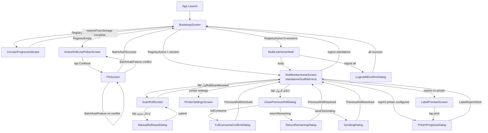

# Roll Worker Screens and Workflows Documentation

**App:** Thermoforming Roll Worker (Flutter)
**Platform:** Android (tablet/phone factory floor)
**Document version:** 2026-05-14
**Audience:** Backend engineers, QA engineers, frontend engineers, AI agents tasked with feature work on this codebase

---

## Table of Contents

1. [Screen Inventory Summary](#1-screen-inventory-summary)
2. [Detailed Screen Documentation](#2-detailed-screen-documentation)
   - 2.1 BootstrapScreen
   - 2.2 MissingConfigScreen
   - 2.3 ActiveShiftLinePickerScreen
   - 2.4 PinScreen
   - 2.5 MultiLineHomeShell
   - 2.6 RollWorkerHomeScreen
   - 2.7 ScanRollScreen
   - 2.8 LabelPreviewScreen
   - 2.9 PrinterSettingsScreen
3. [Workflow Reference](#3-workflow-reference)
4. [Navigation Map](#4-navigation-map)
5. [UX/UI Review by Workflow](#5-uxui-review-by-workflow)
6. [Factory-Floor Operational Scenarios](#6-factory-floor-operational-scenarios)
7. [Manual QA Checklist](#7-manual-qa-checklist)

---

## 1. Screen Inventory Summary

| # | Screen Name | File Path | Widget Type | Main Purpose | Primary Provider Dependencies | API Dependencies | Workflow Owner | Risk Level |
|---|-------------|-----------|-------------|--------------|-------------------------------|-----------------|----------------|------------|
| 1 | BootstrapScreen | `lib/app/bootstrap_screen.dart` | ConsumerStatefulWidget + WidgetsBindingObserver | App entry point; restores session registry from storage; routes to picker or home shell | `multiLineSessionRegistryProvider` | GET `/shift-lines/{id}/roll-worker-session/current` (via restore) | Session lifecycle | **HIGH** — Any failure here blocks the entire app |
| 2 | MissingConfigScreen | `lib/features/config_check/` | StatelessWidget | Shown when `AppConfig` is invalid; blocks app from operating | None | None | Config validation | **HIGH** — Misconfigured build = non-functional production device |
| 3 | ActiveShiftLinePickerScreen | `lib/features/shift_line/presentation/screens/active_shift_line_picker_screen.dart` | ConsumerStatefulWidget | Worker selects which shift lines to join before PIN entry | `activeShiftLineOptionsControllerProvider`, `pickerShiftLineSelectionProvider` | GET `/shift-lines/active-options` | Login / session start | **HIGH** — Incorrect line selection causes wrong session binding |
| 4 | PinScreen | `lib/features/roll_worker_auth/presentation/screens/pin_screen.dart` | ConsumerStatefulWidget | PIN authentication for batch session start | `batchAuthControllerProvider` | POST `/sessions/start-batch` | Login / authentication | **HIGH** — PIN entry; must handle security disposal correctly |
| 5 | MultiLineHomeShell | `lib/features/home/presentation/screens/multi_line_home_shell.dart` | ConsumerWidget | Shell/navigation container for multi-line sessions | `multiLineSessionRegistryProvider` | None directly | Multi-line navigation | **MEDIUM** — Logout menu actions can affect all sessions |
| 6 | RollWorkerHomeScreen | `lib/features/home/presentation/screens/roll_worker_home_screen.dart` | ConsumerStatefulWidget | Per-line home screen; shows roll status, mounted roll, completion stats | `shiftLineSummaryControllerProvider`, `previousRollResolutionControllerProvider`, `rollScanControllerProvider` | GET `/shift-lines/{id}/summary` | Core roll lifecycle | **HIGH** — Central hub for all roll operations |
| 7 | ScanRollScreen | `lib/features/roll_scan/presentation/screens/scan_roll_screen.dart` | ConsumerStatefulWidget | QR/barcode scan or manual entry to mount a roll on the line | `rollScanControllerProvider` | POST `/scan-roll` | Roll mounting | **HIGH** — Incorrect roll mounted to wrong line = production defect |
| 8 | LabelPreviewScreen | `lib/features/label_reprint/presentation/screens/label_preview_screen.dart` | ConsumerStatefulWidget | Preview and optionally print the roll label sticker | `labelReprintControllerProvider` | GET `/rolls/{id}/reprint-label` | Label printing | **MEDIUM** — Print failure delays roll traceability |
| 9 | PrinterSettingsScreen | `lib/features/printer/presentation/screens/printer_settings_screen.dart` | ConsumerWidget | Manage ZPL/TSPL printers, label size, copies | `printerSettingsControllerProvider` | None (TCP connection test only) | Printer configuration | **LOW** — Settings only; no production data at risk |

---

## 2. Detailed Screen Documentation

---

### 2.1 BootstrapScreen

#### 1. Screen Identity

- **File:** `lib/app/bootstrap_screen.dart`
- **Widget type:** `ConsumerStatefulWidget` + `WidgetsBindingObserver`
- **Route:** `/` (root route, always the first rendered widget after GoRouter resolves)
- **Instantiated by:** GoRouter initial location
- **Purpose:** Acts as the app's single entry point state machine. It does not render persistent UI of its own; instead it decides which top-level screen to show based on the registry state.

#### 2. Business Purpose

The BootstrapScreen serves two responsibilities:

1. **Session restoration on cold start.** On first frame, it reads persisted session tokens from `SecureTokenStorage` and attempts to re-verify each token against the backend. If a session is still valid, the worker is returned directly to the home screen without re-entering their PIN.

2. **Lifecycle-aware refresh.** When the app is resumed from the background (e.g., the device was locked overnight on the factory floor), BootstrapScreen triggers a fresh restore pass and re-fetches picker options so the worker always sees live data.

These behaviors are critical in a factory-floor context where workers keep the app open for an entire 8-hour shift.

#### 3. UI Structure

The screen renders one of three possible UI states:

| Registry State | Rendered Widget | Visual |
|----------------|-----------------|--------|
| `RegistryRestoring` | `Center(child: CircularProgressIndicator())` | Full-screen spinner |
| `RegistryEmpty` | `ActiveShiftLinePickerScreen` | Line selection + CTA |
| `RegistryActive` | `MultiLineHomeShell` | Line tabs + home content |

No persistent AppBar or navigation chrome is rendered by BootstrapScreen itself — all of that lives in the child widgets.

Additionally, BootstrapScreen renders `SnackBar` overlays in response to registry lifecycle events. These snackbars are shown over whichever child screen is active.

#### 4. State Management

**Watched provider:** `multiLineSessionRegistryProvider` (`MultiLineSessionRegistryState`)

**`initState` behavior:**
- Schedules `registry.restoreFromStorage()` as a microtask (deferred one frame so the widget tree is fully mounted before async state updates begin).

**`didChangeAppLifecycleState` behavior:**
- On `AppLifecycleState.resumed`:
  - Calls `activeShiftLineOptionsController.refresh()` (picker options stay fresh for multi-line add)
  - Calls `registry.restoreFromStorage()` (re-validates all stored sessions)

**Event consumption from `lastEvent`:**

The registry uses a `lastEvent` field on its state to communicate one-shot side-effect signals to BootstrapScreen. After consuming each event, BootstrapScreen calls `registry.clearLastEvent()` to prevent re-processing on rebuild.

| Event Type | BootstrapScreen Action |
|------------|----------------------|
| `LineLost(shiftLineId)` | Shows SnackBar: `"تم إنهاء الخط أو جلسة عامل الرولات، تم تحديث الحالة"` |
| `BatchAdded` | No snackbar; state already transitioned to `RegistryActive` |
| `DeliberateLogout` | Shows SnackBar: logout confirmation message |
| `PartialLogoutAll(failed)` | Shows SnackBar listing which lines failed to log out |

#### 5. API Integration

BootstrapScreen itself makes no direct API calls. The API calls are delegated:
- `registry.restoreFromStorage()` → internally calls GET `/shift-lines/{id}/roll-worker-session/current` for each stored session id.

#### 6. User Actions

BootstrapScreen has no direct user actions. All tappable elements belong to the child screen (`ActiveShiftLinePickerScreen` or `MultiLineHomeShell`).

#### 7. UI-Enforced Business Rules

- The app never renders home content while `RegistryRestoring` is active. This prevents the worker from interacting with stale or uninitialized session data.
- Snackbar events are consumed exactly once. `clearLastEvent()` is always called after snackbar display.

#### 8. Backend-Authoritative Rules

- If GET `/shift-lines/{id}/roll-worker-session/current` returns `ROLL_WORKER_SESSION_REQUIRED`, the registry drops that session. The backend is the authority on session validity.
- If a line is no longer active (returns `THERMOFORMING_SHIFT_LINE_NOT_ACTIVE`), the line is dropped from the registry and a `LineLost` event is emitted.

#### 9. Loading States

- `RegistryRestoring`: full-screen centered `CircularProgressIndicator` with no text. Typically resolves within 1–3 seconds on a factory Wi-Fi network.

#### 10. Empty States

- `RegistryEmpty`: delegates entirely to `ActiveShiftLinePickerScreen`. BootstrapScreen itself has no empty-state UI.

#### 11. Error States

BootstrapScreen has no dedicated error UI. Failures during `restoreFromStorage()` are handled by the registry:
- Per-session network errors during restore: session is tentatively kept (retry on next resume) OR dropped depending on error type.
- A `LineLost` event surfaced to the user via snackbar is the only visible error acknowledgment.

#### 12. Success States

- `RegistryActive`: renders `MultiLineHomeShell` seamlessly. No explicit success animation.

#### 13. Edge Cases

| Edge Case | Behavior |
|-----------|----------|
| Device has no stored sessions (fresh install) | `RegistryEmpty` immediately after `restoreFromStorage()` completes with nothing to restore |
| All stored sessions are expired | All sessions dropped → `RegistryEmpty` → picker shown |
| Some sessions valid, some expired | Valid sessions kept → `RegistryActive` with subset; expired lines produce `LineLost` events |
| App resumed after network outage | `restoreFromStorage()` may time out per session; sessions with timeout errors are kept with a stale flag pending next successful verify |
| App killed during `RegistryRestoring` | Next cold start restarts restore from scratch |

#### 14. Dependencies

- `multiLineSessionRegistryProvider` (watched)
- `activeShiftLineOptionsControllerProvider` (read on resume)
- `SecureTokenStorage` (internal to registry)
- `WidgetsBinding.instance` (for `addObserver`/`removeObserver`)

#### 15. UX Review

**Strengths:**
- The restore pass is invisible to users who have a valid session — they land directly on the home screen.
- Lifecycle observer ensures worker re-authentication if session expires overnight.

**Weaknesses:**
- No timeout feedback during `RegistryRestoring`. If the backend is slow or unreachable on app start, the spinner shows indefinitely.
- No retry button from the spinner state. Worker has no recourse besides force-closing the app.

#### 16. Risks / Pitfalls

- **Race condition risk:** If `restoreFromStorage()` is not properly guarded against concurrent calls (e.g., quick background→foreground transition), two simultaneous restore passes can issue duplicate API calls. The registry must be idempotent.
- **Snackbar lost if widget not mounted:** If `clearLastEvent()` is called but the widget has been disposed before the snackbar displays, the event is silently dropped. This is acceptable for non-critical messages but means workers may miss `LineLost` notifications if the app transitions too quickly.

#### 17. AI Agent Notes

- When adding new registry events, always add a corresponding case in BootstrapScreen's `lastEvent` listener AND call `clearLastEvent()` after handling.
- The widget is a `WidgetsBindingObserver`; always call `WidgetsBinding.instance.removeObserver(this)` in `dispose()`.
- Do not add navigation logic to this file. BootstrapScreen is intentionally dumb — it delegates rendering entirely to child screens. Keep it that way.

---

### 2.2 MissingConfigScreen

#### 1. Screen Identity

- **File:** `lib/features/config_check/` (exact filename not confirmed; likely `missing_config_screen.dart`)
- **Widget type:** StatelessWidget (no state, no providers)
- **Route:** `/missing-config`
- **Instantiated by:** GoRouter redirect guard when `AppConfig` validation fails

#### 2. Business Purpose

`AppConfig` holds the `baseUrl` (backend API base URL) and `deviceKey` (unique device identifier injected at build time via `--dart-define`). If either is missing, every API call will fail and the app is non-functional. Rather than showing a cryptic network error, the app redirects to this screen to make the misconfiguration explicit.

This screen exists primarily to protect against build pipeline errors where a production APK is deployed without the correct `--dart-define` values.

#### 3. UI Structure

- Static error card with:
  - An error icon (e.g., `Icons.error_outline`)
  - A heading such as "إعداد التطبيق غير مكتمل"
  - A descriptive body explaining that the build configuration is missing and the IT team should be contacted
  - No buttons, no actions

#### 4. State Management

None. This screen is fully static.

#### 5. API Integration

None.

#### 6. User Actions

No user actions are available. The screen is a dead end by design — the worker should contact their IT/maintenance team.

#### 7. UI-Enforced Business Rules

- No navigation away from this screen is provided. The app is intentionally locked.

#### 8. Backend-Authoritative Rules

None applicable.

#### 9. Loading States

None.

#### 10. Empty States

None.

#### 11. Error States

The entire screen is an error state. No further error handling within it.

#### 12. Success States

None. Recovery requires a rebuild/reinstall with correct `--dart-define` values.

#### 13. Edge Cases

| Edge Case | Behavior |
|-----------|----------|
| `baseUrl` present but malformed URL | Should still route here if `AppConfig.isValid` returns false |
| `deviceKey` missing | Same |
| Both missing | Same |

#### 14. Dependencies

- `AppConfig` (resolved at startup via `--dart-define`)
- GoRouter redirect guard

#### 15. UX Review

**Strengths:**
- Explicit error beats silent network failure loops.

**Weaknesses:**
- Arabic-only error message may be unclear to on-site IT staff who may not read Arabic.
- No error code or build fingerprint shown to help IT diagnose which device/build is affected.

#### 16. Risks / Pitfalls

- **Production deployment risk:** This screen being shown on a production device means the factory floor device is 100% non-functional. There should be an automated alerting mechanism (e.g., Sentry) that fires when this screen is ever rendered on a production build.

#### 17. AI Agent Notes

- Do not add navigation logic to this screen. It should remain a dead end.
- If adding a "copy device info to clipboard" button for IT diagnostics, keep it clearly separated from any operational workflow.

---

### 2.3 ActiveShiftLinePickerScreen

#### 1. Screen Identity

- **File:** `lib/features/shift_line/presentation/screens/active_shift_line_picker_screen.dart`
- **Widget type:** `ConsumerStatefulWidget`
- **Route:** Embedded inside `BootstrapScreen` (not a GoRouter route)
- **Instantiated by:** BootstrapScreen when registry state is `RegistryEmpty`

#### 2. Business Purpose

This is the login entry point for the roll worker. Before entering their PIN, the worker must identify which thermoforming shift lines they will be working on during this session. A single worker can operate multiple lines simultaneously (up to the backend-configured maximum).

The screen fetches live data about currently active shift lines from the backend, shows which lines are available, and enforces backend-side blocking reasons (e.g., a line is full, or a different role is already occupying the roll-worker slot). It also surfaces advisory warnings (e.g., another operator is already logged in to a line) without blocking selection.

#### 3. UI Structure

**AppBar:**
- Title: `"اختر خطوط التشكيل"` (Choose forming lines)
- No back button (this is the root screen when not logged in)

**Body (scrollable):**
- Hint/instruction text explaining multi-line selection semantics
- `ListView.builder` of `ActiveShiftLineOptionCard` widgets, one per available line

**Per-line card (`ActiveShiftLineOptionCard`) contains:**
- `Checkbox`: tappable only when `option.selectable == true`
- Line code badge: e.g., `"TH-01"` in a colored chip
- Line name text
- `ConflictBadge` widget: shown when `option.hasOtherActiveOperator == true`; this is **advisory** — it does not disable selection
- Info row 1: Palletizing line code (the downstream palletizing station this line feeds)
- Info row 2: Current active product name
- Info row 3: Current operator name (if any)
- **Mounted roll section** (conditional): if `option.hasMountedRoll == true`, shows `generatedRollId` and `weight` in kg
- **Blocking reason text** (conditional): if `option.selectable == false`, shows a red warning text explaining why selection is blocked

**Fixed bottom bar:**
- CTA button with contextual label:
  - 0 lines selected: `"اختر على الأقل خط واحد"` (disabled)
  - 1 line selected: `"متابعة"` (enabled)
  - N > 1 lines selected: `"متابعة بـ N خطوط"` (enabled)

#### 4. State Management

**Watched providers:**
- `activeShiftLineOptionsControllerProvider` → `ActiveShiftLineOptionsState`
- `pickerShiftLineSelectionProvider` → `Set<int>` (currently selected line IDs)

**`ActiveShiftLineOptionsState` variants:**
| State | Picker Behavior |
|-------|----------------|
| `ActiveShiftLineOptionsInitial` | Empty list, loading indicator in body |
| `ActiveShiftLineOptionsLoading(previous?)` | Shows previous list greyed-out + overlay spinner; or empty list + spinner if no previous |
| `ActiveShiftLineOptionsLoaded(options)` | Full list rendered |
| `ActiveShiftLineOptionsFailureState(failure, previous?)` | Error card with retry; previous list shown if available |

**Post-PinScreen handling:**
- After `PinScreen` pops, the screen reads `BatchAuthState.conflictShiftLineIds` from the returned value
- For each conflicting id, it removes that id from `pickerShiftLineSelectionProvider`
- Calls `options.refresh()` to re-fetch fresh line data
- Calls `ScaffoldMessenger.showSnackBar("خط غير متاح، تم استبعاده")` if any conflicts were found
- Conflict cards are briefly highlighted with an `AnimatedContainer` border/background change to draw attention

#### 5. API Integration

- **Fetch options:** GET `/shift-lines/active-options`
  - Called on `initState` (via `options.refresh()`)
  - Called on resume (via BootstrapScreen's lifecycle observer → `options.refresh()`)
  - Called after PinScreen returns with conflicts
  - Returns: `List<ActiveShiftLineOption>` each with `id`, `lineCode`, `lineName`, `selectable`, `blockingReason?`, `hasOtherActiveOperator`, `hasMountedRoll`, `mountedRoll?`, `palletizingLineCode`, `currentProductName?`, `currentOperatorName?`

#### 6. User Actions

| Action | Trigger | Effect |
|--------|---------|--------|
| Toggle line selection | Tap card or checkbox | Adds/removes id from `pickerShiftLineSelectionProvider`; only when `option.selectable == true` |
| Pull to refresh | SwipeDown | Calls `options.refresh()` |
| Tap CTA "متابعة" | Bottom bar button | Navigates to `PinScreen(selectedIds: selectedSet)` via `Navigator.push` |
| Tap CTA when 0 selected | Bottom bar button (disabled state) | No-op |

#### 7. UI-Enforced Business Rules

- Cards with `selectable == false` render their checkbox as disabled (greyed, non-tappable).
- The CTA button is disabled when selection count is 0 or when the options controller is loading.
- The worker cannot proceed to PIN entry without selecting at least one line.
- Cards with `hasOtherActiveOperator == true` show a `ConflictBadge` but remain selectable. The conflict is advisory only at this stage.

#### 8. Backend-Authoritative Rules

- `selectable == false` and `blockingReason` are set by the backend. The client must not override or ignore them.
- Conflict detection (two workers trying to claim the same line simultaneously) is resolved by the backend during the batch-auth POST, not at the picker stage.
- The backend may return a blocking reason in Arabic that is displayed verbatim to the worker.

#### 9. Loading States

- `ActiveShiftLineOptionsLoading` with `previous != null`: shows the previous list with reduced opacity and a `LinearProgressIndicator` at the top of the list section.
- `ActiveShiftLineOptionsLoading` with `previous == null`: shows a centered `CircularProgressIndicator`.

#### 10. Empty States

- If `options.isEmpty` (no active shift lines currently): shows an empty state card with text `"لا توجد خطوط تشغيل نشطة حالياً"` and a retry/refresh button.

#### 11. Error States

- `ActiveShiftLineOptionsFailureState`: shows error card with a localized failure message and a "إعادة المحاولة" retry button.
- If previous options are available, they are shown behind the error card (stale but better than blank).

#### 12. Success States

- `ActiveShiftLineOptionsLoaded`: full list rendered, selection available, CTA active for ≥1 selection.

#### 13. Edge Cases

| Edge Case | Behavior |
|-----------|----------|
| All lines are blocked (selectable=false) | CTA always disabled; worker must contact supervisor |
| Worker selects a line, it becomes blocked between fetch and PIN submission | Backend returns conflict → conflict handling flow (post-PinScreen) |
| Network error on refresh after PinScreen returns | Error state shown; previously selected (conflicted) ids are already cleared |
| Single line available | Single card; worker has only one choice |
| More lines than fit screen height | ListView is scrollable; bottom CTA is fixed |

#### 14. Dependencies

- `activeShiftLineOptionsControllerProvider` (controls data fetching)
- `pickerShiftLineSelectionProvider` (tracks in-progress selection)
- `batchAuthControllerProvider` (read after PinScreen returns, for conflict ids)
- `Navigator` (for push to PinScreen)

#### 15. UX Review

**Strengths:**
- Multi-line selection in one tap flow before PIN is a good UX pattern — workers commit to their lines before authentication.
- Conflict badge is non-blocking, respecting that line conflicts are often temporary.
- Mounted roll info on the picker card helps the worker verify they're selecting the right line.

**Weaknesses:**
- If `blockingReason` text from the backend is long, the card can become visually cluttered.
- No visual indication of maximum simultaneous lines (if backend enforces one).
- `ConflictBadge` wording may not be clear enough for workers unfamiliar with multi-session concepts.

#### 16. Risks / Pitfalls

- **Selection state stale after conflict resolution:** If `pickerShiftLineSelectionProvider` is not reset on `logout` / `RegistryEmpty`, a returning worker (after logout) may see pre-selected lines from their previous session.
- **Refresh loop:** If the picker continuously calls `refresh()` after conflict resolution while the controller is already loading, a duplicate-request race condition may occur. The controller must debounce or guard concurrent refreshes.

#### 17. AI Agent Notes

- `pickerShiftLineSelectionProvider` must be reset when transitioning from `RegistryActive` back to `RegistryEmpty` (i.e., after logout). Verify this is handled.
- The `options.refresh()` call after PinScreen returns must NOT be awaited in `Navigator.push.then()` unless the controller's `refresh()` is safe to call while a previous refresh is in-flight.
- Do not skip the conflict-highlight animation — it is the only visual feedback to the worker explaining why a line was removed from their selection.

---

### 2.4 PinScreen

#### 1. Screen Identity

- **File:** `lib/features/roll_worker_auth/presentation/screens/pin_screen.dart`
- **Widget type:** `ConsumerStatefulWidget`
- **Route:** Pushed via `Navigator.push` from `ActiveShiftLinePickerScreen`
- **Props:** `shiftLineIds: Set<int>` — the set of line IDs selected on the picker

#### 2. Business Purpose

The PIN screen authenticates the roll worker for the selected set of shift lines in a single batch call. The worker enters their 4–6 digit PIN (the exact length is backend-configured). A successful POST creates one roll-worker session token per selected line, which are stored securely on-device and loaded into the registry.

#### 3. UI Structure

**Layout (vertically centered):**
1. Large icon (worker/person icon)
2. Title text: `"أدخل رقم التعريف الشخصي"` (Enter your PIN)
3. `PinInput` widget: custom digit-bubble input
4. Inline error text (visible only on failure)
5. Submit button: `"تسجيل الدخول"` or disabled spinner during submission

**`PinInput` widget:**
- Shows entered digits as filled circles (bullets) for security
- Supports backspace
- Disabled during `BatchAuthSubmitting`
- Auto-focuses on screen entry

#### 4. State Management

**Watched provider:** `batchAuthControllerProvider` → `BatchAuthState`

**State transitions:**
| State | PinScreen behavior |
|-------|-------------------|
| `BatchAuthInitial` | Input enabled, button enabled (when PIN non-empty) |
| `BatchAuthSubmitting` | Input disabled, button shows loading spinner |
| `BatchAuthSuccess` | Screen pops via `Navigator.pop()` |
| `BatchAuthFailure(failure, conflictShiftLineIds?)` | Input re-enabled; inline error shown OR pop with conflict data |

**`BatchAuthFailure` branching logic:**
- If `conflictShiftLineIds != null && conflictShiftLineIds.isNotEmpty`:
  - Pop with conflict data (do NOT show inline error); the picker handles the conflict UI
- If `conflictShiftLineIds == null` (global error):
  - Show inline error message based on `failure` error code:
    - `OPERATOR_PIN_INVALID` → `"رقم التعريف غير صحيح"`
    - `OPERATOR_LOCKED` → `"تم تعليق حسابك، تواصل مع المشرف"`
    - `ROLL_WORKER_NOT_ALLOWED` → `"غير مسموح لك بالعمل كعامل رولات على هذا الخط"`
    - `ROLL_WORKER_SESSION_BATCH_EMPTY` → `"لم يتم اختيار أي خطوط صالحة"`

#### 5. API Integration

- **Submit PIN:** POST `/sessions/start-batch`
  - Body: `{ pin: String, shiftLineIds: [int] }`
  - Success response: `BatchSessionEntryResponse` — array of `{ shiftLineId, sessionToken, shiftLineSummary }` entries
  - Tokens stored per-line in `SecureTokenStorage`
  - Failure: may return per-line conflicts or global error codes

#### 6. User Actions

| Action | Trigger | Effect |
|--------|---------|--------|
| Enter digit | Tap digit on PinInput | Appends digit to PIN buffer |
| Backspace | Tap backspace on PinInput | Removes last digit |
| Submit | Tap submit button | Calls `batchAuthController.submit(pin, shiftLineIds)` |
| Back/Close | System back or close button | Pops without submitting; calls `batchAuthController.reset()` |

#### 7. UI-Enforced Business Rules

- Submit button is disabled when PIN buffer is empty.
- Submit button is disabled during `BatchAuthSubmitting`.
- `PinInput` is disabled during `BatchAuthSubmitting` to prevent double-entry.

#### 8. Backend-Authoritative Rules

- PIN validity (length, format, correctness) is validated server-side.
- Operator lockout (`OPERATOR_LOCKED`) is a backend-authoritative state; the client cannot unlock.
- The backend decides which lines succeeded and which conflicted in the batch.

#### 9. Loading States

- `BatchAuthSubmitting`: submit button replaced with `CircularProgressIndicator`; PIN input disabled.

#### 10. Empty States

Not applicable. The screen always shows input controls.

#### 11. Error States

- Inline error text below `PinInput`:
  - `OPERATOR_PIN_INVALID`: shown in red
  - `OPERATOR_LOCKED`: shown in red, advises contacting supervisor
  - `ROLL_WORKER_NOT_ALLOWED`: shown in red
  - `ROLL_WORKER_SESSION_BATCH_EMPTY`: shown in red
- On conflict (partial per-line failure): no inline error; screen pops and picker handles conflict display

#### 12. Success States

- `BatchAuthSuccess`: screen pops. BootstrapScreen re-renders `MultiLineHomeShell` (state is now `RegistryActive`).

#### 13. Edge Cases

| Edge Case | Behavior |
|-----------|----------|
| Worker presses back mid-entry | PIN buffer cleared (`dispose`), `batchAuthController.reset()` called |
| All lines in batch conflict | `conflictShiftLineIds` covers all selected lines; picker drops all, shows toast |
| Some lines conflict, some succeed | Backend returns partial success — successful lines are stored, conflict ids returned in response |
| Network timeout during submission | `BatchAuthFailure` with network error message; inline error shown |
| Worker submits same PIN twice rapidly | Second tap blocked by disabled button during `BatchAuthSubmitting` |

#### 14. Dependencies

- `batchAuthControllerProvider`
- `SecureTokenStorage` (internal to controller)
- `multiLineSessionRegistryProvider` (controller calls `registry.onBatchSuccess()`)

#### 15. UX Review

**Strengths:**
- PIN shown as bullets (security best practice).
- Inline errors are specific and actionable.
- Auto-focus on entry eliminates extra taps.

**Weaknesses:**
- No PIN reset / forgot-PIN flow for workers who are locked. Supervisor intervention required.
- No visual indicator of how many digits are expected (no placeholder dots for missing digits).

#### 16. Risks / Pitfalls

- **Security:** PIN buffer must be zeroed/cleared in `dispose()`. Verify this is implemented. Any leakage to logs or error messages is a security issue.
- **Double-submit:** If the controller does not guard against duplicate `submit()` calls while `BatchAuthSubmitting`, a race can occur if the button state update lags one frame.

#### 17. AI Agent Notes

- `batchAuthController.reset()` must always be called when the screen is popped without a `BatchAuthSuccess`. This clears the controller state so the next PinScreen push starts from `BatchAuthInitial`.
- The screen uses `Navigator.push` return value (or a controller state listener) to detect conflict — confirm which pattern is used and document it.
- Do not store the PIN in any persistent storage, logging, or analytics events.

---

### 2.5 MultiLineHomeShell

#### 1. Screen Identity

- **File:** `lib/features/home/presentation/screens/multi_line_home_shell.dart`
- **Widget type:** `ConsumerWidget`
- **Route:** Embedded inside `BootstrapScreen` when registry state is `RegistryActive`
- **Instantiated by:** BootstrapScreen

#### 2. Business Purpose

`MultiLineHomeShell` is the navigation wrapper for the active session. It adapts its layout based on the number of active sessions:

- **1 session:** Renders `RollWorkerHomeScreen` directly with `standaloneScaffold: true`, giving it full control over the AppBar and scaffold.
- **2+ sessions:** Renders a `Scaffold` with a `NavigationBar` (tab bar at the bottom or top) — one tab per active shift line. The active line's `RollWorkerHomeScreen` is shown in the body with `standaloneScaffold: false`.

The shell also hosts the logout menu (popup menu icon in the AppBar) which allows logging out from the current line or all lines simultaneously.

#### 3. UI Structure

**Single-session mode:**
- No shell chrome; `RollWorkerHomeScreen` owns the `Scaffold`

**Multi-session mode:**
- `Scaffold`:
  - `AppBar`:
    - Title: `"عامل الرولات"`
    - Trailing: popup menu icon (`Icons.more_vert`)
  - `NavigationBar` (typically at the bottom):
    - One `NavigationDestination` per active session
    - Destination icon: line-specific icon (e.g., factory line icon)
    - Destination label: `lineCode` (e.g., `"TH-01"`) or fallback `"خط N"` where N is 1-indexed
    - Selected destination corresponds to `registry.activeShiftLineId`
  - `body`: `RollWorkerHomeScreen(shiftLineId: activeShiftLineId, standaloneScaffold: false, lineIndex: activeIndex, headerActions: [logoutIcon])`

**Popup menu items:**
1. `"تسجيل خروج من الخط الحالي"` — logs out only the currently active (visible) line
2. `"تسجيل خروج من جميع الخطوط"` — shows `LogoutAllConfirmDialog`

#### 4. State Management

**Watched provider:** `multiLineSessionRegistryProvider` → `MultiLineSessionRegistryState`

Key fields used:
- `state.sessions`: `List<ShiftLineSession>` — all active sessions
- `state.activeShiftLineId`: `int` — which line is currently visible
- `state.logoutStatus`: `LogoutStatus?` — in-progress logout state (used to disable menu during logout)

When `NavigationBar` item is tapped:
1. `registry.setActive(shiftLineId)` — updates active line
2. `summaryController(shiftLineId).refresh()` — ensures home content is fresh for the newly selected line

#### 5. API Integration

No direct API calls. Logout operations are delegated to the registry:
- Single line logout: `registry.logout(activeShiftLineId)` → internally POST `/shift-lines/{id}/roll-worker-logout`
- All lines logout: `registry.logoutAll()` → internally parallel POST for each line

#### 6. User Actions

| Action | Trigger | Effect |
|--------|---------|--------|
| Switch active line | Tap NavigationBar destination | `registry.setActive(id)` + `summaryController.refresh()` |
| Logout current line | Popup menu → "تسجيل خروج من الخط الحالي" | `registry.logout(activeShiftLineId)` |
| Logout all lines | Popup menu → "تسجيل خروج من جميع الخطوط" | Shows `LogoutAllConfirmDialog` |

#### 7. UI-Enforced Business Rules

- In single-session mode, the shell renders no chrome so the home screen can render its own full AppBar.
- The popup menu is only shown in multi-session mode (the per-line logout in single-session is in `RollWorkerHomeScreen`'s own AppBar).
- The `NavigationBar` is not shown in single-session mode.

#### 8. Backend-Authoritative Rules

- Logout success/failure is backend-driven. A failed logout for a line does not remove it from the registry until the backend confirms.
- If all logout attempts fail, the `LogoutAllConfirmDialog` shows a retry panel.

#### 9. Loading States

- No explicit loading indicator in the shell itself during navigation.
- Each `RollWorkerHomeScreen` manages its own loading state.
- During `logoutAll`, the popup menu icon may be disabled to prevent duplicate calls.

#### 10. Empty States

Not applicable. If `RegistryActive` is true, there is always at least one session. If all sessions are removed (after logout), BootstrapScreen transitions to `RegistryEmpty`.

#### 11. Error States

- Partial logout failure is surfaced via `LogoutAllConfirmDialog` retry panel, not in the shell itself.
- Single-line logout failure: handled within the registry; a snackbar is shown if the line fails to log out.

#### 12. Success States

- Successful single-line logout: registry drops the session; if only one session remained, BootstrapScreen transitions to `RegistryEmpty`. If multiple sessions remain, `NavigationBar` updates.
- Successful all-logout: `LogoutAllConfirmDialog` auto-closes; registry transitions to `RegistryEmpty`.

#### 13. Edge Cases

| Edge Case | Behavior |
|-----------|----------|
| Active line is logged out while on its tab | Registry reassigns `activeShiftLineId` to another valid session |
| Session count goes from 2 to 1 after logout | Shell transitions to single-session mode (no NavigationBar) |
| `logoutAll()` called with 1 remaining session | Should behave identically to single-line logout |
| Worker loses network mid-logout | `LogoutAllResult.failed` includes the affected lines; retry option shown |

#### 14. Dependencies

- `multiLineSessionRegistryProvider`
- `shiftLineSummaryControllerProvider` (read on tab switch)
- `LogoutAllConfirmDialog`
- `RollWorkerHomeScreen`

#### 15. UX Review

**Strengths:**
- `NavigationBar` pattern is familiar to mobile users.
- Line codes as labels are meaningful to factory workers who know their line IDs.

**Weaknesses:**
- If a line has a pending action (unmounted roll, open close-dialog), switching tabs silently abandons context. There is no warning.
- Line codes like "TH-01" may be hard to read in small NavigationBar labels on low-DPI devices.

#### 16. Risks / Pitfalls

- **Tab switch without summary refresh:** If `summaryController.refresh()` is not called on tab switch, the newly visible home screen may show stale data from the last time that line was active.
- **Orphaned dialog:** If a `ClosePreviousRollDialog` is open on line A and the worker switches to line B via the NavigationBar, the dialog remains in the widget tree. This could lead to controller state mismatch.

#### 17. AI Agent Notes

- The single-session / multi-session branching in `build()` is purely presentational — the underlying data model (`MultiLineSessionRegistryState`) always tracks sessions as a list.
- `headerActions` passed to `RollWorkerHomeScreen` in multi-session mode replaces the home screen's own AppBar actions. Ensure any new actions added to the single-session AppBar are also passed as `headerActions` in multi-session mode.

---

### 2.6 RollWorkerHomeScreen

#### 1. Screen Identity

- **File:** `lib/features/home/presentation/screens/roll_worker_home_screen.dart`
- **Widget type:** `ConsumerStatefulWidget`
- **Route:** Embedded inside `MultiLineHomeShell`
- **Props:**
  - `shiftLineId: int` — the shift line this screen instance manages
  - `lineIndex: int = 1` — 1-based index for display (used in multi-line headers)
  - `standaloneScaffold: bool = true` — if true, this screen owns its `Scaffold`/AppBar
  - `headerActions: List<Widget>?` — passed by the shell in multi-session mode to override AppBar actions

#### 2. Business Purpose

This is the primary working screen for the roll worker throughout their shift. From here, the worker can:
1. See what product is currently running on their line.
2. See the currently mounted roll (its ID and remaining weight).
3. Close the previous roll (record consumption outcome).
4. Scan and mount a new roll.
5. View shift-level completion statistics.
6. Handle a roll that was returned by the operator (incompatible product switch case).
7. Print or reprint roll labels.

Everything that happens during a shift — from the first roll scan to the last roll close — flows through this screen.

#### 3. UI Structure

**When `standaloneScaffold: true`:**
- Full `Scaffold` with:
  - `AppBar`: title `"عامل الرولات"` + printer settings icon + logout icon (rightmost)
  
**When `standaloneScaffold: false`:**
- No `Scaffold` wrapper (the shell provides it)
- `CompactLineHeader` shown at top: displays `lineCode` + `lineName` for context

**Body (scrollable column, top to bottom):**

1. **`CompactLineHeader`** (only when `!standaloneScaffold`): single-row line identifier
2. **`ActiveProductChip`** (hidden when `summary.activeProduct == null`): shows current product
3. **`SummaryCard`**: shows `completedRollsInShift` (total line count) + `"منك: N"` subline if worker-specific count > 0
4. **`ReturnedRemainingCard`** (conditional, shown when `summary.returnedRemainingRoll != null`): banner for operator-returned roll
5. **`_MountSection`** (the primary action area):
   - **`SummaryLoading`**: skeleton/shimmer card or centered spinner
   - **`SummaryLoaded` with `mountedRoll != null`**: `CompactMountedRollCard` + action buttons row:
     - "إغلاق الرول" (primary) → opens `ClosePreviousRollDialog`
     - Reprint button (shown when previous resolution has `reprintAvailable == true`)
   - **`SummaryLoaded` with `mountedRoll == null`**: empty-mount state card + `"مسح رول"` button (primary CTA)
   - **`SummaryError`**: error card with "إعادة المحاولة" retry button

#### 4. State Management

**Watched providers:**
- `shiftLineSummaryControllerProvider(shiftLineId)` → `ShiftLineSummaryState`
- `previousRollResolutionControllerProvider(shiftLineId)` → `PreviousRollResolutionState`
- `rollScanControllerProvider(shiftLineId)` → `RollScanState`

**Listeners (side effects):**

`RollScanMounted`:
- Calls `summaryController.refresh()` to load newly mounted roll data
- Shows snackbar: `"تم تركيب الرول بنجاح"` with green color

`PreviousRollResolved`:
- Calls `summaryController.refresh()` to clear mounted roll and update completion count
- Shows snackbar: `"تم إغلاق الرول بنجاح"`
- If `resolution.reprintAvailable == true`, shows reprint button in `_MountSection`

#### 5. API Integration

| Operation | Method | Endpoint | Triggered By |
|-----------|--------|----------|-------------|
| Load summary | GET | `/shift-lines/{id}/summary` | `initState`, `refresh()` after mount/close, SSE reconnect |
| SSE stream | GET (SSE) | `/shift-lines/{id}/events` (via `OperatorDashboardSyncController`) | Automatic on session start |

The home screen itself does not make direct API calls. All data fetching is done through controller methods.

#### 6. User Actions

| Action | Trigger | Navigates To / Opens |
|--------|---------|---------------------|
| Scan roll | Tap "مسح رول" button | `ScanRollScreen(shiftLineId)` via `Navigator.push` |
| Close roll | Tap "إغلاق الرول" button | `showClosePreviousRollDialog(context, shiftLineId)` |
| Reprint label | Tap reprint button (post-close) | If printer configured: `PrintInProgressDialog.show()`; else: `LabelPreviewScreen` |
| Acknowledge returned roll | Tap button on `ReturnedRemainingCard` | `summaryController.acknowledgeReturnedRemaining()` |
| Retry summary | Tap retry on error card | `summaryController.load()` |
| Printer settings | Tap printer icon in AppBar | `PrinterSettingsScreen` via `Navigator.push` |
| Logout | Tap logout icon in AppBar (standalone mode) | `registry.logout(shiftLineId)` |

#### 7. UI-Enforced Business Rules

- "إغلاق الرول" button is only shown when `mountedRoll != null`. There is no close action when nothing is mounted.
- "مسح رول" button is only shown when `mountedRoll == null`. Once a roll is mounted, scanning is blocked until the current roll is closed.
- Reprint button is only shown after a roll has been explicitly closed in this session (`PreviousRollResolved` state with `reprintAvailable == true`). It is not shown for historical rolls from previous sessions.
- `ReturnedRemainingCard` is only shown when `summary.returnedRemainingRoll != null`. It disappears after acknowledgment.
- `ActiveProductChip` is hidden when there is no active product (line is idle / between product runs).

#### 8. Backend-Authoritative Rules

- `mountedRoll` data (ID, weight) comes from the backend summary. The client cannot locally mutate it.
- `completedRollsInShift` is incremented server-side on roll close; the client refreshes after confirmation.
- `returnedRemainingRoll` is set by the backend in response to an operator's product-switch action; the roll worker cannot trigger this state themselves.
- `reprintAvailable` flag in `PreviousRollResolution` is set by the backend based on whether a label exists for the closed roll.

#### 9. Loading States

- `SummaryLoading`: `_MountSection` shows a shimmer/skeleton card. `SummaryCard` shows inline spinner when `isRefreshing: true` during refresh (while old data remains visible).
- `SummaryLoaded + isRefreshing: true`: existing data shown, subtle refresh indicator (e.g., `LinearProgressIndicator` at top of section).

#### 10. Empty States

- `mountedRoll == null`: empty mount state — card with message `"لا يوجد رول مُركَّب حالياً"` and "مسح رول" CTA.
- `activeProduct == null`: `ActiveProductChip` hidden; no empty state shown — the screen still renders fully.
- `completedRollsInShift == 0`: `SummaryCard` shows `"0"` — this is valid at shift start.

#### 11. Error States

- `SummaryError`: error card with message and retry button. All action buttons hidden.
- `RollScanFailureState`: handled in `ScanRollScreen`, not on home screen.
- `PreviousRollFailureState`: handled in dialog, not on home screen.

#### 12. Success States

- `SummaryLoaded` with populated `mountedRoll`: full mount section visible, close and reprint actions available.
- After `RollScanMounted`: snackbar + auto-refresh renders the newly mounted roll.
- After `PreviousRollResolved`: snackbar + auto-refresh clears mounted roll and increments count.

#### 13. Edge Cases

| Edge Case | Behavior |
|-----------|----------|
| Summary loads but `mountedRoll` data is stale (weight not updated) | SSE `ROLL_CONSUMPTION_SEGMENT_RECORDED` updates weight in real-time via `applyRollSegmentRecorded()` |
| Worker mounts a roll on another device (same line) | SSE `MACHINE_ROLL_STATE` event triggers summary refresh |
| Product changed mid-shift | SSE `PRODUCT_CHANGED` updates `ActiveProductChip` without full summary reload |
| Operator performs product switch, returns remaining roll | SSE `ROLL_RETURNED_REMAINING` → `ReturnedRemainingCard` appears |
| Worker is on this screen when session is lost | `registry.notifySessionLost()` fires → BootstrapScreen snackbar → transition to picker |

#### 14. Dependencies

- `shiftLineSummaryControllerProvider(shiftLineId)`
- `previousRollResolutionControllerProvider(shiftLineId)`
- `rollScanControllerProvider(shiftLineId)`
- `labelReprintControllerProvider(shiftLineId)` (read for reprint action)
- `multiLineSessionRegistryProvider` (for logout action in standalone mode)
- `printerSettingsControllerProvider` (read to determine reprint route)

#### 15. UX Review

**Strengths:**
- Single-screen hub for all roll lifecycle actions — minimal navigation needed during work.
- SSE-driven updates mean weight and product information stay accurate without polling.
- Snackbar feedback after mount/close is clear and brief.

**Weaknesses:**
- The "إغلاق الرول" and "مسح رول" buttons are both prominent CTAs that alternate — there is a risk of the worker tapping the wrong one if they are not reading carefully.
- The `ReturnedRemainingCard` is visually distinct but may be easy to miss if the worker scrolls past it quickly.

#### 16. Risks / Pitfalls

- **Missing `refresh()` after scan/close:** If either listener fails to call `summaryController.refresh()`, the home screen will show stale data indefinitely (the SSE stream alone may not push a full summary update).
- **Concurrent state updates:** `RollScanMounted` and `PreviousRollResolved` should never fire simultaneously on the same screen. But if controller reset logic is missing, a stale `PreviousRollResolved` from a previous close could trigger after a new roll is mounted.

#### 17. AI Agent Notes

- The `standaloneScaffold` prop fundamentally changes this screen's rendering. Any AppBar action added to the standalone path must also be considered for the `headerActions` path in `MultiLineHomeShell`.
- All three watched providers are keyed by `shiftLineId` (family providers). When writing tests, always inject the correct `shiftLineId` as the family parameter.
- `summaryController.refresh()` is safe to call multiple times; it should be idempotent and debounced if called in rapid succession.

---

### 2.7 ScanRollScreen

#### 1. Screen Identity

- **File:** `lib/features/roll_scan/presentation/screens/scan_roll_screen.dart`
- **Widget type:** `ConsumerStatefulWidget`
- **Route:** Pushed via `Navigator.push` from `RollWorkerHomeScreen`
- **Props:** `shiftLineId: int`

#### 2. Business Purpose

This screen allows the roll worker to scan the QR code on a physical roll (the barcode printed on the roll packaging) and mount that roll to their shift line. The scanning process:
1. Captures a 12-digit numeric code from the QR (or manual input).
2. Validates the format client-side.
3. POSTs to the backend to record the mount.
4. Pops back to the home screen on success.

This is the most frequent action a roll worker performs — typically multiple times per hour.

#### 3. UI Structure

**AppBar:**
- Back/close button
- Title: `"مسح الرول"`

**Body (conditional):**
- When `RollScanIdle` or `RollScanFailureState`:
  - `QrScannerView` (full-screen camera view)
  - Error card overlay (at bottom) when `RollScanFailureState`
- When `RollScanSubmitting`:
  - `_SubmittingPanel`: centered spinner with text `"جارٍ التحقق من الرول..."`

**Fixed bottom bar:**
- "إدخال يدوي" (Manual entry) button — shown in idle/error states; disabled during `RollScanSubmitting`

#### 4. State Management

**Watched provider:** `rollScanControllerProvider(shiftLineId)` → `RollScanState`

| State | Screen Behavior |
|-------|----------------|
| `RollScanIdle` | Camera active, bottom bar visible |
| `RollScanSubmitting` | Camera hidden, spinner shown, manual entry disabled |
| `RollScanMounted(roll)` | Screen pops (home listener handles snackbar + refresh) |
| `RollScanFailureState(failure, previous?)` | Error card shown at bottom; camera force-restarted (key change on `QrScannerView`) |

**Camera restart on error:**
When `RollScanFailureState` is detected, the `QrScannerView` widget is force-rebuilt by changing its `key`. This is necessary because many camera libraries freeze on consecutive scan attempts without a rebuild.

#### 5. API Integration

- **Mount roll:** POST `/scan-roll`
  - Body: `{ shiftLineId: int, rollCode: String }`
  - Success: `{ mountedRoll: MountedRollDto }` — returned to home screen via controller state
  - Known error codes:
    - `ROLL_NOT_FOUND`: code does not match any roll in the system
    - `ROLL_ALREADY_CONSUMED`: roll was previously fully consumed
    - `ROLL_ACTIVE_ON_ANOTHER_LINE`: roll is currently mounted on a different line
    - `ROLL_BLOCKED`: roll has been administratively blocked
    - `ROLL_TYPE_NOT_ALLOWED_FOR_PRODUCT`: roll material is incompatible with current product

#### 6. User Actions

| Action | Trigger | Effect |
|--------|---------|--------|
| Scan QR | Camera detects QR code | Validates format → calls `controller.mountRoll(code)` |
| Manual entry | Tap "إدخال يدوي" button | Opens `ManualRollInputDialog` |
| Enter code manually | Type in dialog text field | Same validation + `controller.mountRoll(code)` |
| Back | AppBar back / system back | Pops; `controller.reset()` called |

#### 7. UI-Enforced Business Rules

- **12-digit validation:** Client-side regex `^\d{12}$` must pass before API call. Invalid codes show an inline error (e.g., `"الرمز يجب أن يكون 12 رقماً"`) without making an API call.
- Manual entry button is disabled during `RollScanSubmitting`.
- The camera does not automatically retry after a scan failure — the worker must re-scan or use manual entry.

#### 8. Backend-Authoritative Rules

- All `ROLL_*` error codes above are backend-authoritative. The client maps them to Arabic messages but cannot override the decision.
- `ROLL_TYPE_NOT_ALLOWED_FOR_PRODUCT` specifically means the backend's product/roll-type compatibility matrix rejected the roll. This is a configuration-level check, not a data error.

#### 9. Loading States

- `RollScanSubmitting`: full-screen spinner replaces the camera view.

#### 10. Empty States

Not applicable. The camera view is the default state.

#### 11. Error States

| Error Code | Displayed Message |
|------------|-------------------|
| `ROLL_NOT_FOUND` | `"الرول غير موجود في النظام"` |
| `ROLL_ALREADY_CONSUMED` | `"هذا الرول تم استهلاكه مسبقاً"` |
| `ROLL_ACTIVE_ON_ANOTHER_LINE` | `"هذا الرول مُركَّب حالياً على خط آخر"` |
| `ROLL_BLOCKED` | `"هذا الرول محجوب"` |
| `ROLL_TYPE_NOT_ALLOWED_FOR_PRODUCT` | `"نوع الرول غير متوافق مع المنتج الحالي"` |
| Invalid format (client) | `"الرمز يجب أن يكون 12 رقماً"` |
| Network error | `"خطأ في الشبكة، حاول مجدداً"` |

After error display, the camera is restarted (key-based rebuild) so the worker can immediately re-scan.

#### 12. Success States

- `RollScanMounted`: screen pops. Home screen listener shows snackbar and refreshes summary.

#### 13. Edge Cases

| Edge Case | Behavior |
|-----------|----------|
| QR code decoded but contains non-digit characters | Client-side validation fails; inline error shown; no API call |
| QR code is 12 digits but wrong roll | `ROLL_NOT_FOUND` from backend |
| Same roll scanned twice | `ROLL_ALREADY_CONSUMED` or `ROLL_ACTIVE_ON_ANOTHER_LINE` from backend |
| Camera permission not granted | `QrScannerView` shows permission request UI; manual entry still available |
| Multiple QR codes in camera frame | Scanner should take the first decoded code; behavior depends on camera library |
| Manual entry dialog submitted empty | Submit button disabled until non-empty |

#### 14. Dependencies

- `rollScanControllerProvider(shiftLineId)`
- `QrScannerView` (camera widget, device-dependent)
- `ManualRollInputDialog`

#### 15. UX Review

**Strengths:**
- Camera-first UX matches the physical action (point at roll barcode).
- Manual entry fallback handles damaged/unreadable barcodes.
- Immediate camera restart after error keeps the workflow fast.

**Weaknesses:**
- Workers wearing gloves may find it hard to use the manual entry keyboard on small phone screens.
- No visual "scanning" indicator (crosshair, laser line) to help workers align the camera.

#### 16. Risks / Pitfalls

- **Camera library lifecycle:** Many Flutter camera plugins require careful `dispose()` + `resume()` management. If the camera is not properly disposed when the screen pops, it can leave a dangling resource.
- **Duplicate API call:** If `QrScannerView` fires multiple decode events for the same frame before the controller reaches `RollScanSubmitting`, two API calls can race. The controller must guard against this.

#### 17. AI Agent Notes

- The `RollScanController.mountRoll()` method must check if state is already `RollScanSubmitting` before issuing a new request. Do not allow concurrent mounts.
- The 12-digit regex `^\d{12}$` is a client-side pre-validation only. Do not rely on it as a security control.
- When adding new error codes from the backend, add the mapping to both the controller's failure conversion logic and the error card's display logic.

---

### 2.8 LabelPreviewScreen

#### 1. Screen Identity

- **File:** `lib/features/label_reprint/presentation/screens/label_preview_screen.dart`
- **Widget type:** `ConsumerStatefulWidget`
- **Route:** Pushed via `Navigator.push` from `RollWorkerHomeScreen`
- **Props:** `shiftLineId: int`, `generatedRollId: String`

#### 2. Business Purpose

This screen fetches and displays the printable label sticker for a roll. It serves two scenarios:

1. **No printer configured:** Worker navigates here to preview the label and optionally print if they configure a printer or use the dialog.
2. **Printer configured (alternative entry):** Typically `PrintInProgressDialog.show()` is used directly, but this screen acts as a preview fallback.

The label contains all traceability data: roll ID, type, color, length, weight. Factory floor supervisors may use this screen to verify label data before reprinting.

#### 3. UI Structure

**AppBar:**
- Back button
- Title: `"معاينة الملصق"`

**Body (state-conditional):**

| State | UI Rendered |
|-------|------------|
| `LabelReprintIdle / LabelReprintFetching` | Centered `CircularProgressIndicator` with loading text |
| `LabelReprintReady / LabelReprintPrinting / LabelReprintSent` | `LabelStickerWidget(label)` + print button |
| `LabelReprintFailureState` | Error card + "إعادة المحاولة" retry button |

**Print button:**
- Labeled: `"طباعة"` or shows spinner during `LabelReprintPrinting`
- On tap: calls `PrintInProgressDialog.show(context, shiftLineId)`
- After dialog closes: calls `previewOnly(generatedRollId)` to refresh the preview

#### 4. State Management

**Watched provider:** `labelReprintControllerProvider(shiftLineId)` → `LabelReprintState`

**`initState` behavior:**
- If state is `LabelReprintIdle`: calls `controller.previewOnly(generatedRollId)` immediately.
- If state is already `LabelReprintReady` or `LabelReprintSent`: skips the initial fetch (label already cached in controller state).

**After `PrintInProgressDialog` closes:**
- Calls `controller.previewOnly(generatedRollId)` again to ensure the preview is fresh (in case it was invalidated by the print operation).

#### 5. API Integration

- **Fetch label:** GET `/rolls/{generatedRollId}/reprint-label`
  - Returns: `RollLabelReprintResponse` with all label fields
  - Called on `initState` and after print dialog closes

#### 6. User Actions

| Action | Trigger | Effect |
|--------|---------|--------|
| Print | Tap print button | Opens `PrintInProgressDialog.show(context, shiftLineId)` |
| Retry | Tap retry on error card | `controller.retry()` → re-fetches label |
| Back | AppBar back | Pops screen |

#### 7. UI-Enforced Business Rules

- Print button is disabled during `LabelReprintFetching` and `LabelReprintPrinting`.
- If no label data is available (idle or error), the print button is not shown.

#### 8. Backend-Authoritative Rules

- Label field values (roll ID, weight, length, etc.) are fetched from the backend and cannot be modified on the client. The label displays exactly what the backend returns.

#### 9. Loading States

- `LabelReprintFetching`: spinner centered in body.
- `LabelReprintPrinting`: print button shows spinner; `LabelStickerWidget` still visible.

#### 10. Empty States

Not applicable. Either a label is loaded or an error is shown.

#### 11. Error States

- `LabelReprintFailureState`: error card with message from `failure.message` + retry button.

#### 12. Success States

- `LabelReprintReady`: label displayed, print button active.
- `LabelReprintSent`: print command successfully sent to printer; brief success state (dialog handles this, screen shows label still).

#### 13. Edge Cases

| Edge Case | Behavior |
|-----------|----------|
| Roll label was never generated (new roll) | Backend may return 404 → `LabelReprintFailureState` with "لا يوجد ملصق لهذا الرول" |
| Worker presses back during fetch | Screen pops; controller state remains (may be reused if label is fetched) |
| Printer connection fails during print | `PrintInProgressDialog` handles error; preview screen stays open |

#### 14. Dependencies

- `labelReprintControllerProvider(shiftLineId)`
- `PrintInProgressDialog`
- `LabelStickerWidget`

#### 15. UX Review

**Strengths:**
- Visual preview prevents workers from printing incorrect labels.
- Retry button provides recovery without needing to navigate back.

**Weaknesses:**
- Loading spinner with no progress indication may frustrate workers on slow networks.

#### 16. Risks / Pitfalls

- **Stale label after print:** If the worker reprints multiple times and the label data changes between prints (e.g., weight updated), the preview may show outdated data. The post-dialog refresh mitigates this.

#### 17. AI Agent Notes

- `previewOnly()` vs `reprint()`: `previewOnly()` fetches without sending to printer; `reprint()` fetches AND sends. The screen should only call `previewOnly()` — the dialog calls the print path. Do not conflate them.

---

### 2.9 PrinterSettingsScreen

#### 1. Screen Identity

- **File:** `lib/features/printer/presentation/screens/printer_settings_screen.dart`
- **Widget type:** `ConsumerWidget`
- **Route:** Pushed via `Navigator.push` from `RollWorkerHomeScreen`

#### 2. Business Purpose

Allows the roll worker (or supervisor) to configure the ZPL/TSPL label printer that the device will connect to over TCP. Settings include:
- Which printers are defined (IP, port, name, timeout)
- Which printer is the default
- Label size preset
- Number of copies per print job

Settings are stored locally in Hive (on-device, no server sync). These settings persist across app restarts.

#### 3. UI Structure

**AppBar:** Title `"إعدادات الطابعة"` + back button

**Sections:**

**Section 1 — Printers List:**
- `ListTile` per configured printer
  - Printer name + IP:port
  - "افتراضي" badge if it's the default printer
  - Edit icon → opens `showPrinterFormDialog(context, existing: printer)`
  - Delete icon → `AlertDialog` confirmation → removes printer
- "إضافة طابعة" FAB or button → `showPrinterFormDialog(context)`

**`showPrinterFormDialog` fields:**
| Field | Type | Validation |
|-------|------|-----------|
| IP Address | Text (IP format) | Required, valid IPv4 |
| Port | Number | Required, 1–65535 |
| Name | Text | Required |
| Timeout | Number (seconds) | Optional, default 5s |
| Test Connection | Button | Sends test TCP connection, shows success/failure inline |

**Section 2 — Label Size:**
- `RadioListTile` per preset:
  - 40×30 mm
  - 50×25 mm
  - 50×30 mm
  - 60×40 mm
  - 100×50 mm
- Selecting a preset saves immediately via `PrinterSettingsController`

**Section 3 — Copies:**
- Row with "-" button, current count display, "+" button
- Range: 1–10
- Changes saved immediately

#### 4. State Management

**Watched provider:** `printerSettingsControllerProvider` → `PrinterSettingsState`

Includes:
- `printers: List<PrinterConfig>`
- `defaultPrinterId: String?`
- `selectedLabelSize: LabelSizePreset`
- `copies: int`

All changes are persisted to Hive synchronously after each update.

#### 5. API Integration

None (except the TCP test connection, which is a direct device-to-printer network call, not through the backend API).

#### 6. User Actions

| Action | Effect |
|--------|--------|
| Add printer | Opens form dialog; on save: adds to Hive |
| Edit printer | Opens form dialog prefilled; on save: updates in Hive |
| Delete printer | Confirmation dialog; on confirm: removes from Hive |
| Set default | Tapping a non-default printer's "set default" option: updates `defaultPrinterId` |
| Test connection | Inline button in form; attempts TCP connect; shows success/failure |
| Change label size | Radio tile tap: saves `selectedLabelSize` to Hive |
| Change copies | +/- buttons: saves `copies` to Hive |

#### 7. UI-Enforced Business Rules

- Copies range is clamped 1–10; "+" button disabled at 10, "-" button disabled at 1.
- Delete is blocked if the printer being deleted is the only configured printer (or requires confirmation that it will leave no default printer).
- Test connection is a non-destructive operation; failure does not prevent saving.

#### 8. Backend-Authoritative Rules

None. All printer settings are local.

#### 9-12. States

- No complex loading states; Hive reads are synchronous.
- Error state only possible during TCP test connection → inline result shown in dialog.

#### 13. Edge Cases

| Edge Case | Behavior |
|-----------|----------|
| Device has no printers configured | Empty state in printer list with "إضافة طابعة" prompt |
| Printer unreachable during test | Shows error inline in dialog; does not prevent saving |
| Worker saves invalid IP | Validation error on form; save blocked |

#### 14. Dependencies

- `printerSettingsControllerProvider`
- Hive storage for printer config
- TCP socket for test connection

#### 15-17. UX/Risks/AI Notes

- Settings are local-only; if the device is reset, printer configuration is lost. Workers should be instructed to reconfigure after a factory reset.
- For AI agents: printer label size presets are hardcoded client-side. Adding a new preset requires a code change, not a backend config update.

---

## 3. Workflow Reference

---

### Workflow A — App Startup (Cold Start)

**Trigger:** Worker taps app icon on device

**Preconditions:**
- Device has network access to backend
- App has been installed with valid `--dart-define` values

**Steps:**
1. `main()` executes: initializes `PrintingLocalStorage.initialize()` (Hive for printer settings)
2. `ProviderScope` initializes all Riverpod providers
3. `GoRouter` resolves `/` → `BootstrapScreen`
4. `BootstrapScreen.initState()` runs → schedules `registry.restoreFromStorage()` as microtask
5. Registry state transitions: `RegistryRestoring`
6. `restoreFromStorage()` reads persisted session IDs from `SecureTokenStorage`
7. For each stored session ID: GET `/shift-lines/{id}/roll-worker-session/current`
   - If valid response → session kept in registry
   - If `ROLL_WORKER_SESSION_REQUIRED` → session dropped; `LineLost` event queued
   - If network error → session tentatively kept (retry on resume)
8. Registry transitions to `RegistryEmpty` (no valid sessions) OR `RegistryActive` (at least one valid session)
9. BootstrapScreen re-renders appropriate child

**Success paths:**
- `RegistryEmpty` → worker sees `ActiveShiftLinePickerScreen`
- `RegistryActive` → worker sees their home screen with previous session restored

**Error paths:**
- All API calls fail (network down) → depends on implementation: either empty state or best-effort kept sessions

**State changes:** `RegistryRestoring` → `RegistryEmpty` | `RegistryActive`

**Performance note:** With N sessions, N parallel GET calls are made. On a factory Wi-Fi with typical latency of 20–50ms, this completes in under 500ms for up to 5 sessions.

---

### Workflow B — Multi-Line Session Start (Login)

**Trigger:** Worker taps "متابعة" on `ActiveShiftLinePickerScreen` after selecting ≥1 lines

**Preconditions:**
- Registry is in `RegistryEmpty` state
- At least one line selected in `pickerShiftLineSelectionProvider`
- At least one selected line has `selectable == true`

**Steps:**
1. Worker selects line(s) on picker (taps checkboxes)
2. Taps "متابعة" or "متابعة بـ N خطوط" CTA
3. `Navigator.push` → `PinScreen(shiftLineIds: selectedIds)`
4. Worker enters PIN digits on `PinInput`
5. Taps "تسجيل الدخول" submit button
6. `batchAuthController.submit(pin, selectedIds)` called
7. State transitions: `BatchAuthInitial` → `BatchAuthSubmitting`
8. POST `/sessions/start-batch` with `{ pin, shiftLineIds }`
9a. **Success:** `BatchSessionEntryResponse` with per-line tokens returned
   - Each token stored in `SecureTokenStorage` keyed by `shiftLineId`
   - `registry.onBatchSuccess(sessions)` called
   - Registry transitions: `RegistryEmpty` → `RegistryActive`
   - `BatchAuthState` → `BatchAuthSuccess`
   - `PinScreen` pops
   - BootstrapScreen re-renders `MultiLineHomeShell`
9b. **Partial conflict:** Some lines conflict, some succeed
   - Successful line tokens stored
   - `conflictShiftLineIds` included in `BatchAuthFailure`
   - `PinScreen` pops with conflict data
   - Picker removes conflicted ids from selection
   - Picker calls `options.refresh()`
   - Toast: `"خط غير متاح، تم استبعاده"`
   - If at least one successful line → registry transitions to `RegistryActive`
   - If zero successful lines → registry stays `RegistryEmpty`; worker must re-select
9c. **Global failure:** `OPERATOR_PIN_INVALID`, `OPERATOR_LOCKED`, etc.
   - `BatchAuthFailure` with no `conflictShiftLineIds`
   - Inline error shown on `PinScreen`
   - Worker can retry with correct PIN

**State changes:** `BatchAuthInitial` → `BatchAuthSubmitting` → (`BatchAuthSuccess` | `BatchAuthFailure`)
**Registry:** `RegistryEmpty` → `RegistryActive`

---

### Workflow C — Home Screen Loading

**Trigger:** `RegistryActive` renders `RollWorkerHomeScreen` (either fresh login or app restore)

**Preconditions:** Valid session token exists for `shiftLineId`

**Steps:**
1. `RollWorkerHomeScreen` renders with `shiftLineId`
2. `shiftLineSummaryControllerProvider(shiftLineId)` is initialized
3. Controller emits `SummaryLoading`
4. GET `/shift-lines/{shiftLineId}/summary` with session token in headers
5. Response parsed into `ShiftLineSummary`:
   - `activeProduct`: current product or null
   - `mountedRoll`: currently mounted roll data or null
   - `completedRollsInShift`: total rolls completed
   - `returnedRemainingRoll`: data if operator returned a partial roll
6. Controller emits `SummaryLoaded(summary)`
7. UI renders all sections with real data
8. `OperatorDashboardSyncController` starts SSE connection for real-time updates

**State changes:** `SummaryLoading` → `SummaryLoaded`

---

### Workflow D — Roll Scan (Mount Roll)

**Trigger:** Worker taps "مسح رول" on home screen (only available when `mountedRoll == null`)

**Preconditions:**
- `SummaryLoaded` with `mountedRoll == null`
- Valid session token

**Steps:**
1. `Navigator.push(ScanRollScreen(shiftLineId))`
2. Camera activates via `QrScannerView`
3a. **QR path:**
   - Worker points camera at roll QR code
   - `QrScannerView` decodes → string value passed to scan handler
   - Client validates: `^\d{12}$` regex check
   - If invalid → inline error shown, camera restarts
   - If valid → `controller.mountRoll(code)` called
4. `RollScanState` → `RollScanSubmitting`
5. POST `/scan-roll` with `{ shiftLineId, rollCode }`
6a. **Success:** `{ mountedRoll }` returned
   - `RollScanState` → `RollScanMounted(roll)`
   - `ScanRollScreen` pops
   - `RollWorkerHomeScreen` listener fires → `summaryController.refresh()`
   - Snackbar: `"تم تركيب الرول بنجاح"`
6b. **Failure:** Error code returned
   - `RollScanState` → `RollScanFailureState(failure)`
   - Error card shown on `ScanRollScreen`
   - `QrScannerView` force-rebuilt (key change) → camera ready for next scan
   - Worker may retry or use manual entry

3b. **Manual path:**
   - Worker taps "إدخال يدوي"
   - `ManualRollInputDialog` opens
   - Worker types 12-digit code
   - Same validation + `mountRoll()` call as QR path

**State changes:** `RollScanIdle` → `RollScanSubmitting` → (`RollScanMounted` | `RollScanFailureState`)

---

### Workflow E — Previous Roll Close (Full Consume)

**Trigger:** Worker taps "إغلاق الرول" on home screen

**Preconditions:** `SummaryLoaded` with `mountedRoll != null`

**Steps:**
1. `showClosePreviousRollDialog(context, shiftLineId)` opens `ClosePreviousRollDialog`
2. Dialog shows three exclusive options:
   - "الاستهلاك الكامل" (Full consume)
   - "إرجاع المتبقي" (Return remaining)
   - "إرسال للطحن" (Send to grinding)
3. Worker selects "الاستهلاك الكامل"
4. `ClosePreviousRollDialog` returns `ClosePreviousRollAction.fullConsume`
5. `FullConsumeConfirmDialog` opens:
   - Shows roll ID and confirmation message
   - "تأكيد" button → `previousRollResolutionController.fullConsume()`
6. `PreviousRollResolutionState` → `PreviousRollResolving`
7. POST `/previous-roll/full-consume` (no body; shiftLineId in headers via session token)
8. Success: `resolution` returned with `reprintAvailable` flag
9. `PreviousRollResolutionState` → `PreviousRollResolved(resolution)`
10. Dialog auto-closes
11. `RollWorkerHomeScreen` listener fires → `summaryController.refresh()` + snackbar `"تم إغلاق الرول بنجاح"`
12. Home screen re-renders: `mountedRoll == null`, `completedRollsInShift` incremented, reprint button shown if `reprintAvailable == true`

**Roll state after:** `CONSUMED`

---

### Workflow F — Previous Roll Close (Return Remaining)

**Trigger:** Same as E, but worker selects "إرجاع المتبقي"

**Steps:**
1–4. Same as E (choice selection in `ClosePreviousRollDialog`)
5. `ReturnRemainingDialog` opens:
   - `RemainingWeightField` for weight input
   - Validation: `weight >= 0` AND `weight <= mount.lastKnownWeightKg`
   - "تأكيد" button → `previousRollResolutionController.returnRemaining(weight)`
6. POST `/previous-roll/return` with `{ remainingWeightKg: double }`
7. Success: `PreviousRollResolved(resolution)` with `reprintAvailable: true`
8. Home screen refresh; `ReturnedRemainingCard` does NOT appear (that's for operator-driven returns); reprint button shown

**Client-side validation rules:**
- Weight field must not be empty
- Weight must be numeric (decimal allowed)
- Weight must be ≥ 0
- Weight must be ≤ `mount.lastKnownWeightKg` (prevents recording more than was on the roll)

**Roll state after:** `RETURNED` (partially consumed, remainder physically returned to warehouse)

---

### Workflow G — Previous Roll Close (Send to Grinding)

**Trigger:** Same as E, but worker selects "إرسال للطحن"

**Steps:** Identical to Workflow F but:
- Dialog: `GrindingDialog` instead of `ReturnRemainingDialog`
- API: POST `/previous-roll/grinding` with `{ remainingWeightKg: double }`
- Roll state after: `SENT_TO_GRINDING`

**Business context:** When a roll is nearly empty but not worth returning to inventory, it is sent to the grinding machine. This is a permanent, irreversible action.

---

### Workflow H — Label Reprint

**Trigger A (printer configured):**
- Worker closes a roll (Workflow E/F/G) and `resolution.reprintAvailable == true`
- Reprint button appears on home screen
- Worker taps reprint button
- `PrintInProgressDialog.show(context, shiftLineId)` opens directly

**Trigger B (no printer configured):**
- Worker taps reprint button
- `LabelPreviewScreen(shiftLineId, generatedRollId)` pushed
- Worker sees label preview
- Taps "طباعة" button → `PrintInProgressDialog.show()`

**Steps (shared from PrintInProgressDialog):**
1. Dialog opens, shows spinner
2. `labelReprintController.reprint(generatedRollId)` called
3. GET `/rolls/{id}/reprint-label` → `RollLabelReprintResponse`
4. TSPL/ZPL command generated from label data
5. TCP connection opened to configured printer (IP:port)
6. Print command bytes sent
7. Connection closed
8a. Success → `LabelReprintSent` → dialog shows "تمت الطباعة بنجاح" → auto-close after delay
8b. Failure → `LabelReprintFailureState` → dialog shows error + retry button

**State changes:** `LabelReprintIdle` → `LabelReprintFetching` → `LabelReprintPrinting` → (`LabelReprintSent` | `LabelReprintFailureState`)

---

### Workflow I — SSE Product Changed

**Trigger:** Backend emits `PRODUCT_CHANGED` SSE event on the line's event stream

**Preconditions:** `OperatorDashboardSyncController` is connected (SSE stream active)

**Steps:**
1. SSE event arrives with `ProductChangedPayload` (new product id, name, code)
2. `OperatorDashboardSyncController` dispatches to `summaryController.applyProductChanged(payload)`
3. Controller updates `summary.activeProduct` in place
4. `ActiveProductChip` re-renders with new product name
5. No REST call made; update is purely SSE-driven

**Why this matters:** On a high-throughput factory floor, product changes can happen multiple times per shift. The SSE-driven approach means the worker always sees the current product without manual refresh.

---

### Workflow J — SSE Roll Consumption Segment Recorded

**Trigger:** Backend emits `ROLL_CONSUMPTION_SEGMENT_RECORDED` SSE event

**Steps:**
1. SSE event arrives with payload including updated `lastKnownWeightKg`
2. `summaryController.applyRollSegmentRecorded(payload)` called
3. `CompactMountedRollCard` re-renders with updated weight display
4. No REST call needed

**Why this matters:** The thermoforming machine records roll weight consumption in segments as it processes material. The worker can see the roll emptying in real-time, which helps them anticipate when to prepare a new roll.

---

### Workflow K — SSE Roll Returned Remaining (Operator-Driven)

**Trigger:** Backend emits `ROLL_RETURNED_REMAINING` SSE event (caused by operator doing a product switch that requires clearing the current roll)

**Steps:**
1. SSE event arrives with `RollReturnedRemainingPayload` (generatedRollId, returnedWeightKg, oldProductName, newProductName)
2. `summaryController.applyRollReturnedRemaining(payload)` called
3. `summary.mountedRoll` cleared, `summary.returnedRemainingRoll` set
4. `ReturnedRemainingCard` becomes visible on home screen
5. Worker sees the card explaining: "تم إرجاع المتبقي بواسطة المشغل"
6. Worker taps "تأكيد" on the card → `summaryController.acknowledgeReturnedRemaining()`
7. Card disappears; worker can now scan a new roll for the new product

**Why this matters:** When the operator switches to a new product on the thermoforming machine, any partially consumed roll of the old material cannot continue. The backend automatically returns it. The roll worker must acknowledge this to confirm they are aware the previous roll is no longer mounted.

---

### Workflow L — Session Logout (Single Line)

**Trigger:** Worker taps logout icon (standalone mode) OR popup "تسجيل خروج من الخط الحالي" (multi-session mode)

**Steps:**
1. `registry.logout(activeShiftLineId)` called
2. POST `/shift-lines/{id}/roll-worker-logout` with `{ sessionToken }`
3. Session token deleted from `SecureTokenStorage`
4. Registry drops session from `sessions` list
5a. If this was the last session → `RegistryEmpty` → BootstrapScreen shows picker
5b. If other sessions remain → `RegistryActive` updated; `activeShiftLineId` reassigned to first remaining session; NavigationBar updates

**On failure:** API call fails → session NOT removed from registry; snackbar shown with error

---

### Workflow M — Session Logout (All Lines)

**Trigger:** Popup → "تسجيل خروج من جميع الخطوط" → `LogoutAllConfirmDialog`

**Steps:**
1. `LogoutAllConfirmDialog` opens with confirmation text
2. Worker taps "تأكيد"
3. `registry.logoutAll()` called
4. Parallel POST `/roll-worker-logout` for each active session
5. `LogoutAllResult(succeeded: List<int>, failed: List<int>)` returned
6a. Full success (all lines logged out):
   - All tokens deleted from `SecureTokenStorage`
   - Registry → `RegistryEmpty`
   - Dialog auto-closes
   - BootstrapScreen shows picker
6b. Partial failure (some lines failed):
   - Succeeded lines removed from registry
   - Failed lines kept in registry
   - Dialog shows retry panel: "فشل تسجيل الخروج من: [line names]"
   - Retry button calls `registry.logoutAll()` for remaining failed lines

**BootstrapScreen event:** `DeliberateLogout` event emitted for full success; `PartialLogoutAll(failed)` for partial failure.

---

### Workflow N — Cascade Session Loss (Automatic)

**Trigger:** Any API call for a session returns `ROLL_WORKER_SESSION_REQUIRED` or `THERMOFORMING_SHIFT_LINE_NOT_ACTIVE`

**Steps:**
1. Controller receives the error
2. Controller calls `registry.notifySessionLost(shiftLineId)`
3. Registry drops the session (without making a logout API call — session is already invalid)
4. `LineLost(shiftLineId)` event queued on registry state
5. BootstrapScreen listener fires → snackbar: `"تم إنهاء الخط أو جلسة عامل الرولات، تم تحديث الحالة"`
6. If last session → `RegistryEmpty`; if other sessions remain → `RegistryActive` with updated list

**This workflow handles:**
- Session expired after prolonged idle (e.g., shift ended, worker forgot to log out)
- Line deactivated by admin mid-shift
- Server-side forced session invalidation

---

## 4. Navigation Map

### Mermaid Diagram

### Written Navigation Description

**Root:** The app always starts at `BootstrapScreen`. This screen is never popped — it is always the base of the navigation stack.

**From BootstrapScreen:**
- `RegistryEmpty` → `ActiveShiftLinePickerScreen` is rendered inline (not pushed). It replaces the spinner.
- `RegistryActive` → `MultiLineHomeShell` (which embeds `RollWorkerHomeScreen`) is rendered inline.

**From ActiveShiftLinePickerScreen:**
- Tapping Continue → **push** `PinScreen`
- PinScreen result → pop back to picker; picker may call `options.refresh()`

**From RollWorkerHomeScreen:**
- "مسح رول" → **push** `ScanRollScreen`
- "إغلاق الرول" → **showDialog** `ClosePreviousRollDialog` → chains to confirm dialogs
- Reprint (printer configured) → **showDialog** `PrintInProgressDialog`
- Reprint (no printer) → **push** `LabelPreviewScreen` → **showDialog** `PrintInProgressDialog`
- Printer settings icon → **push** `PrinterSettingsScreen`
- Logout icon (standalone) → triggers `registry.logout()` directly (no separate screen)

**From MultiLineHomeShell:**
- NavigationBar tabs → changes active session (no navigation, just state update)
- Popup "logout all" → **showDialog** `LogoutAllConfirmDialog`

**From ScanRollScreen:**
- "إدخال يدوي" → **showDialog** `ManualRollInputDialog` (dismiss: back to scan screen)
- Successful scan → **pop** back to home screen

**Key rule:** All dialog flows (`ClosePreviousRollDialog`, `FullConsumeConfirmDialog`, `ReturnRemainingDialog`, `GrindingDialog`, `PrintInProgressDialog`, `LogoutAllConfirmDialog`) use `showDialog` and return to the screen that opened them. They are not GoRouter routes.

**GoRouter routes in use:**
- `/` → BootstrapScreen
- `/missing-config` → MissingConfigScreen
- All other navigation uses imperative `Navigator.push` / `showDialog`

---

## 5. UX/UI Review by Workflow

| Workflow | Current UX Strength | Current UX Risk | Recommended Improvement | Priority |
|----------|--------------------|-----------------|-----------------------|----------|
| A — App Startup | Seamless restore for returning workers; no re-login needed if session valid | Infinite spinner with no timeout during `RegistryRestoring`; worker cannot force retry | Add a timeout (e.g., 15 seconds) after which a "Retry" button appears with an error message indicating network issues | **HIGH** |
| B — Multi-Line Session Start | Multi-line selection in one flow before PIN is efficient; conflict feedback is specific | No max-line indicator; worker doesn't know if they're trying to select too many lines | Show a subtitle like "يمكنك اختيار حتى N خطوط" on the picker AppBar | **MEDIUM** |
| C — Home Screen Loading | Summary loaded with immediate spinner; SSE starts automatically | No offline indicator; if SSE is disconnected silently, worker sees stale data without knowing | Show a subtle "غير متصل" badge when SSE connection is in `reconnecting` state | **HIGH** |
| D — Roll Scan | Camera-first with manual fallback; immediate visual feedback | Camera alignment difficult without guide; multiple QR codes in frame may cause unexpected behavior | Add a scan region overlay (crosshair rectangle) to `QrScannerView`; debounce scan events to prevent duplicates | **HIGH** |
| E — Full Consume | Simple 3-option dialog; confirmation step prevents accidental full consume | Dialog options are text-only; workers who are slow readers may mis-tap | Add icons to each option in `ClosePreviousRollDialog` (checkmark for full consume, return arrow for remaining, grinder for grinding) | **MEDIUM** |
| F — Return Remaining | Weight validation prevents impossible inputs | Weight field shows no unit label inside the input widget itself (only nearby text) | Embed "كجم" suffix inside the text field | **LOW** |
| G — Send to Grinding | Same as F | Weight shown in decimals only; workers may enter whole numbers without decimal | Accept both integer and decimal input; display normalized | **LOW** |
| H — Label Reprint | `PrintInProgressDialog` handles all print states; worker gets clear success/failure | If printer is misconfigured (wrong IP), the print job hangs silently until TCP timeout | Show a timeout indicator and a "Cancel" button in `PrintInProgressDialog` that is available after 5 seconds of waiting | **HIGH** |
| I — SSE Product Changed | Chip updates instantly; no user action needed | `ActiveProductChip` may be visually small and workers might not notice a product change | Flash the chip briefly (border animation) when the product changes via SSE | **MEDIUM** |
| J — SSE Roll Consumption Segment | Weight updates in real-time are excellent UX for anticipating roll end | Weight updates may be jarring if they jump significantly in one SSE event | Animate the weight number change with a count-up/count-down transition | **LOW** |
| K — SSE Roll Returned Remaining | `ReturnedRemainingCard` is a visually distinct banner | Banner can be missed if worker is not looking at the screen when it appears | Play a subtle notification sound + vibrate when `ReturnedRemainingCard` first appears | **MEDIUM** |
| L — Logout Single Line | Clean and immediate | Logout icon in AppBar (standalone) is small; workers may accidentally tap it | Add a confirmation dialog for single-line logout (currently it executes immediately) | **HIGH** |
| M — Logout All Lines | `LogoutAllConfirmDialog` has explicit confirmation step | Retry panel for partial failure may confuse workers; they may not understand which lines failed | Show line codes and names in the retry panel, not just IDs | **MEDIUM** |
| N — Cascade Session Loss | Worker is notified via snackbar | Snackbar duration may be too short (default 4 seconds) for workers to read the Arabic text | Increase snackbar duration to 8 seconds for session-loss events; add an action button "موافق" | **MEDIUM** |

---

## 6. Factory-Floor Operational Scenarios

This section documents real-world usage patterns observed on thermoforming factory floors. These scenarios drive the UX and business logic decisions in the app.

---

### Scenario 1 — Shift Start (New Worker, No Prior Session)

**Context:** It is 6:00 AM, a new shift begins. A roll worker picks up the shared tablet at their workstation.

**Expected flow:**
1. App opens → `RegistryEmpty` (no stored session) → picker shown immediately
2. Worker sees list of active shift lines — typically 2–4 lines running in their area
3. Worker selects their assigned line(s) based on the physical line assignment board
4. Worker taps Continue → PIN screen
5. Worker enters their personal PIN
6. Login succeeds → home screen shows their line(s)
7. Home screen shows `mountedRoll == null` (machine has no roll mounted at shift start)
8. Worker scans the first roll from the material cart → roll mounted → shift begins

**Key UX consideration:** At shift start, the worker is typically in a hurry. The picker → PIN → home flow should take no more than 30 seconds total under normal network conditions.

---

### Scenario 2 — Mid-Shift Roll Change (Common, High Frequency)

**Context:** It is 10:30 AM. The currently mounted roll is running out. The line machine has consumed it.

**Expected flow:**
1. Worker receives SSE events showing weight dropping to near-zero
2. `CompactMountedRollCard` shows weight as ~0.5 kg
3. Worker taps "إغلاق الرول" → chooses "الاستهلاك الكامل"
4. Confirms in `FullConsumeConfirmDialog`
5. Roll is recorded as CONSUMED; home screen refreshes
6. Worker picks up a new roll from the cart, taps "مسح رول"
7. Scans QR code on new roll → roll mounted
8. Workflow repeats

**Frequency:** Typically 3–8 roll changes per line per 8-hour shift depending on roll size and production speed.

**Key performance requirement:** The entire close-scan-mount sequence (steps 3–7) should complete in under 60 seconds. Network latency above 2 seconds per API call will cause the worker to delay the machine.

---

### Scenario 3 — Damaged Barcode (Manual Entry)

**Context:** A roll's QR code barcode sticker is damaged or missing. The printed number is still readable.

**Expected flow:**
1. Worker opens `ScanRollScreen`
2. Camera cannot decode the damaged barcode
3. Worker taps "إدخال يدوي"
4. `ManualRollInputDialog` opens
5. Worker types the 12-digit code from the printed number on the roll side label
6. Submits → roll mounts normally

**Key UX consideration:** The manual entry keyboard must be large enough for factory workers wearing work gloves. A numeric-only keypad (not full QWERTY) is strongly preferred.

---

### Scenario 4 — Product Switch by Operator (Roll Worker Perspective)

**Context:** The machine operator on the same line decides to switch from Product A to Product B. The current roll (Product A material) cannot continue.

**Expected flow (from roll worker's perspective):**
1. Worker is on home screen, `CompactMountedRollCard` shows a roll is mounted
2. Operator performs the product switch on their own operator dashboard
3. Backend processes the switch; emits `ROLL_RETURNED_REMAINING` SSE event
4. `ReturnedRemainingCard` appears on the roll worker's home screen
5. Card shows: old product name, new product name, roll ID, returned weight
6. Worker acknowledges the card → it disappears
7. Worker now scans a new roll appropriate for Product B
8. New roll mounts → production continues with new product

**Key edge case:** The roll worker may not have been told about the product switch verbally. The `ReturnedRemainingCard` is their notification. This makes the SSE event critically important for operational continuity.

---

### Scenario 5 — Multi-Line Worker (Advanced)

**Context:** A senior worker manages two thermoforming lines simultaneously during a period of high staffing shortage.

**Expected flow:**
1. Worker selects both Line TH-01 and Line TH-03 on the picker
2. Enters PIN → logs in to both lines simultaneously
3. Home shell shows NavigationBar with two tabs: "TH-01" and "TH-03"
4. Worker switches between tabs throughout the shift as each line needs attention
5. On Line TH-01: roll is running out → worker closes it, scans new roll
6. Switches to TH-03 tab → handles a returned remaining card
7. At end of shift: logs out from all lines via popup menu

**Key UX consideration:** The NavigationBar badges should ideally show an indicator when a line tab needs attention (e.g., a roll close is pending). This is a future enhancement; currently no badge mechanism exists.

---

### Scenario 6 — Session Loss Mid-Shift (Shift Line Deactivated)

**Context:** A machine breakdown forces the supervisor to deactivate Line TH-02 at 2:00 PM. The worker is actively using it.

**Expected flow:**
1. Worker makes any API call (summary refresh, scan, etc.) on TH-02's session
2. Backend returns `THERMOFORMING_SHIFT_LINE_NOT_ACTIVE`
3. `registry.notifySessionLost(TH-02_id)` called
4. TH-02 session dropped from registry
5. If worker only had TH-02 → picker shown; worker must contact supervisor
6. If worker had TH-01 and TH-02 → TH-02 tab disappears; TH-01 continues normally
7. Snackbar: "تم إنهاء الخط أو جلسة عامل الرولات، تم تحديث الحالة"

**Key recovery path:** Worker on single line who loses it must re-login when/if the line is reactivated. This is the expected behavior — no automatic reconnection to a deactivated line.

---

### Scenario 7 — Night Shift Device Handover

**Context:** A device is shared between shifts. The outgoing worker (night shift) does not explicitly log out. The incoming worker (morning shift) picks up the tablet.

**Expected flow:**
1. Incoming worker wakes up the device
2. App resumes; `didChangeAppLifecycleState(resumed)` fires
3. `restoreFromStorage()` called → night shift worker's sessions verified with backend
4a. If sessions still valid (shift still active): morning worker sees the previous worker's home screen. They must log out and log in with their own PIN.
4b. If sessions expired (shift ended, backend invalidated): `LineLost` events emitted → picker shown for morning worker to log in fresh

**Operational recommendation:** Devices should be locked to a shift-specific login, or the app should prompt for re-authentication when the device has been idle for more than N hours. This is a product-level decision not currently implemented.

---

### Scenario 8 — Print Label After Roll Close (Common Post-Close Action)

**Context:** Worker closes a roll and wants to print a label for traceability (attach to the closed roll for warehouse identification).

**Expected flow:**
1. Worker completes Workflow E/F/G (roll close)
2. Reprint button appears on home screen
3. If printer is configured: worker taps reprint → `PrintInProgressDialog` opens → label prints → dialog closes
4. If printer not configured (common during initial setup period): worker taps reprint → `LabelPreviewScreen` opens → worker can show label to supervisor or configure printer

**Key note:** Label printing is optional — the roll close itself does not depend on successful printing. A failed print does not undo the roll close.

---

## 7. Manual QA Checklist

This checklist is intended for QA engineers performing manual regression testing before each release. Test all items on a physical Android device connected to the staging backend.

---

### Section A — App Startup & Session Restore

- [ ] **A1** — Fresh install: app shows spinner briefly then `ActiveShiftLinePickerScreen`
- [ ] **A2** — Login, close app completely (force close), reopen: app restores session without PIN entry
- [ ] **A3** — Login, wait for session to expire on backend (or use admin tool to invalidate), reopen app: session is dropped, picker shown, snackbar appears
- [ ] **A4** — Login to 2 lines, close app, reopen: both lines restored in `MultiLineHomeShell`
- [ ] **A5** — Login, background app for 10+ minutes (device locks), resume: `restoreFromStorage()` fires; session re-verified
- [ ] **A6** — Boot app with no network: `RegistryRestoring` spinner; after network restores, retry works
- [ ] **A7** — Build with missing `--dart-define` (test APK without config): `MissingConfigScreen` shown

---

### Section B — Line Picker

- [ ] **B1** — Picker loads with correct list of active shift lines
- [ ] **B2** — Lines with `selectable == false` show blocking reason text and checkbox is disabled
- [ ] **B3** — Lines with `hasOtherActiveOperator == true` show `ConflictBadge` but remain selectable
- [ ] **B4** — Selecting 1 line: CTA shows "متابعة"
- [ ] **B5** — Selecting 2 lines: CTA shows "متابعة بـ 2 خطوط"
- [ ] **B6** — Selecting 0 lines: CTA is disabled
- [ ] **B7** — Pull-to-refresh: list reloads
- [ ] **B8** — Lines with mounted rolls: mounted roll data visible on card
- [ ] **B9** — Network error on load: error card shown with retry

---

### Section C — PIN Entry & Authentication

- [ ] **C1** — Correct PIN + valid lines: success, navigates to home screen
- [ ] **C2** — Wrong PIN: inline error "رقم التعريف غير صحيح", PIN clears
- [ ] **C3** — Locked account: inline error "تم تعليق حسابك"
- [ ] **C4** — Back button during PIN entry: returns to picker, PIN buffer cleared
- [ ] **C5** — Submit button disabled while `BatchAuthSubmitting` (prevent double-submit)
- [ ] **C6** — Conflict on one line, success on other: picker shown for conflicted line; home shown for successful line
- [ ] **C7** — Conflict highlighted with animation on picker after PinScreen pop
- [ ] **C8** — Toast "خط غير متاح، تم استبعاده" shown when conflict occurs

---

### Section D — Home Screen

- [ ] **D1** — `SummaryLoading`: spinner shown
- [ ] **D2** — `SummaryLoaded` with `mountedRoll != null`: roll card shown, "إغلاق الرول" button visible, "مسح رول" button NOT visible
- [ ] **D3** — `SummaryLoaded` with `mountedRoll == null`: empty state shown, "مسح رول" button visible
- [ ] **D4** — `SummaryError`: error card shown with retry
- [ ] **D5** — `completedRollsInShift` shown correctly in `SummaryCard`
- [ ] **D6** — `ActiveProductChip` shown when product active; hidden when no product
- [ ] **D7** — Snackbar "تم تركيب الرول بنجاح" after successful scan
- [ ] **D8** — Snackbar "تم إغلاق الرول بنجاح" after successful close
- [ ] **D9** — Reprint button appears after close when `reprintAvailable == true`
- [ ] **D10** — `ReturnedRemainingCard` shown when `returnedRemainingRoll != null`
- [ ] **D11** — `ReturnedRemainingCard` disappears after acknowledgment

---

### Section E — Roll Scan

- [ ] **E1** — Camera activates when `ScanRollScreen` opens
- [ ] **E2** — Valid QR code scanned: spinner shown, roll mounts, screen pops
- [ ] **E3** — Invalid QR format (not 12 digits): inline error, no API call, camera restarts
- [ ] **E4** — `ROLL_NOT_FOUND`: error card shown, camera restarts
- [ ] **E5** — `ROLL_ALREADY_CONSUMED`: error card shown
- [ ] **E6** — `ROLL_ACTIVE_ON_ANOTHER_LINE`: error card shown
- [ ] **E7** — `ROLL_BLOCKED`: error card shown
- [ ] **E8** — `ROLL_TYPE_NOT_ALLOWED_FOR_PRODUCT`: error card shown
- [ ] **E9** — "إدخال يدوي" button opens dialog
- [ ] **E10** — Manual entry: valid 12-digit code → mount succeeds
- [ ] **E11** — Manual entry: invalid format → inline error, no API call
- [ ] **E12** — "إدخال يدوي" button disabled during `RollScanSubmitting`
- [ ] **E13** — Back button: returns to home screen, controller reset

---

### Section F — Roll Close

- [ ] **F1** — "إغلاق الرول" button only visible when roll is mounted
- [ ] **F2** — `ClosePreviousRollDialog` shows 3 exclusive options
- [ ] **F3** — Full consume flow: confirm dialog → success → home refreshed, count incremented
- [ ] **F4** — Return remaining flow: weight input required; weight > lastKnownWeightKg rejected
- [ ] **F5** — Return remaining flow: weight 0 accepted (entire roll returned)
- [ ] **F6** — Grinding flow: same validation as return remaining
- [ ] **F7** — All close dialogs: back/cancel returns to home screen
- [ ] **F8** — `PreviousRollResolving` state: spinner shown in dialog, buttons disabled
- [ ] **F9** — `PreviousRollFailureState`: error shown in dialog, retry available
- [ ] **F10** — After close: `mountedRoll == null` on home screen (via refresh)

---

### Section G — Label Reprint

- [ ] **G1** — Reprint button routes to `PrintInProgressDialog` when printer is configured
- [ ] **G2** — Reprint button routes to `LabelPreviewScreen` when no printer configured
- [ ] **G3** — `LabelPreviewScreen`: spinner during fetch, label shown after load
- [ ] **G4** — `LabelStickerWidget` shows all required fields (roll ID, type, color, lengths, weight)
- [ ] **G5** — Print button in dialog: spinner during print, success message after
- [ ] **G6** — Print failure: error shown in dialog, retry available
- [ ] **G7** — Printer connection timeout (wrong IP): error shown within ~5 seconds

---

### Section H — Multi-Line Mode

- [ ] **H1** — Logging in with 2 lines: `NavigationBar` shows 2 tabs with line codes
- [ ] **H2** — Tapping tab: active line switches, home content updates
- [ ] **H3** — Summary refresh triggered on tab switch
- [ ] **H4** — Popup menu shows "تسجيل خروج من الخط الحالي" and "تسجيل خروج من جميع الخطوط"
- [ ] **H5** — Single-line logout: tab removed; if last line, picker shown
- [ ] **H6** — Logout all: `LogoutAllConfirmDialog` shown
- [ ] **H7** — Logout all success: all tabs removed, picker shown
- [ ] **H8** — Logout all partial failure: retry panel shows failed line names

---

### Section I — SSE Real-Time Updates

- [ ] **I1** — Product change SSE event: `ActiveProductChip` updates without manual refresh
- [ ] **I2** — Consumption segment SSE event: `CompactMountedRollCard` weight updates in real-time
- [ ] **I3** — Roll returned remaining SSE event: `ReturnedRemainingCard` appears
- [ ] **I4** — SSE connection loss: reconnecting state shown (or banner if implemented)
- [ ] **I5** — SSE reconnects after network outage: events resume, no duplicate data

---

### Section J — Printer Settings

- [ ] **J1** — Add printer: form validates IP, port, name; saves to Hive
- [ ] **J2** — Edit printer: form prefilled, changes saved
- [ ] **J3** — Delete printer: confirmation dialog; confirmed delete removes printer
- [ ] **J4** — Test connection: success on reachable printer IP; error on unreachable
- [ ] **J5** — Label size selection: radio selects and saves
- [ ] **J6** — Copies +/-: increments/decrements; clamped at 1 and 10
- [ ] **J7** — Settings persist after app restart (read from Hive)

---

### Section K — Error Handling & Edge Cases

- [ ] **K1** — Session loss mid-operation: snackbar shown, picker shown (or remaining lines shown)
- [ ] **K2** — Network goes down mid-scan: error shown, camera restarts
- [ ] **K3** — Network goes down mid-close-dialog: error shown in dialog, retry available
- [ ] **K4** — Device rotated during scan: camera continues working (orientation handling)
- [ ] **K5** — Low battery / system interrupt during print: no data corruption; roll close is already recorded
- [ ] **K6** — All lines blocked on picker: CTA permanently disabled; no crash
- [ ] **K7** — Worker presses back rapidly during login flow: no zombie states; controller reset properly
- [ ] **K8** — App opened on device without camera (emulator): manual entry available, no crash

---

*Document end. Version: 2026-05-14. Maintained by: AI agent context for thermoforming_roll_worker project.*
